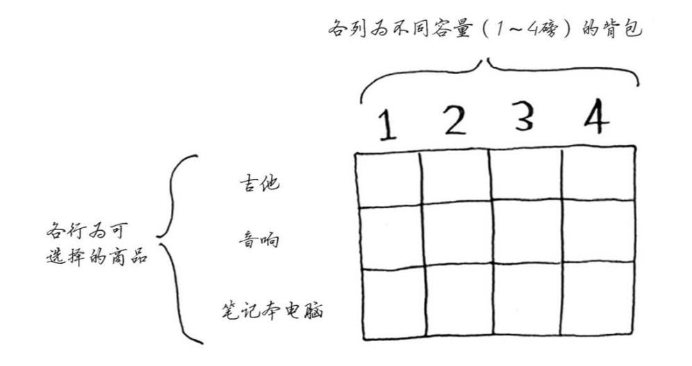
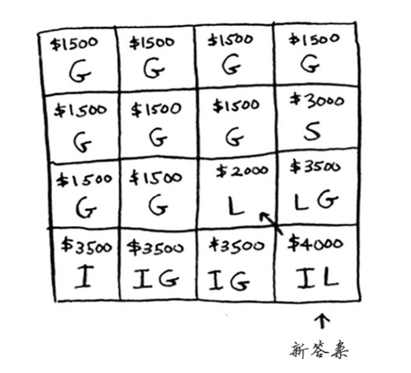
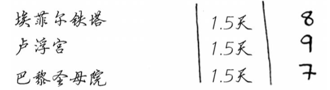

# 背包问题 (Knapsack problem)

### 0-1背包问题  

（摘自[《算法图解》](http://www.ituring.com.cn/book/1864)）  

最基础的背包问题，是0-1背包问题。说的是，有一个固定容量的背包，和有n个物品，每个物品有各自的重量和价值，且仅有一件，如何选择哪些物品装进背包里，使得价值最大化。  
一个简单的例子，你有一个背包，最多能承重35磅，现在3个物品，重量和价值如下，怎样选择，使得装进背包里的物品总价值最大。

如果用贪婪算法，先装下最贵的音响，接下就装不下任何东西了，总价值3000美元，得到近似解，但不是最理想的3500美元(笔记本电脑+吉他)。  

最简单的算法是：尝试各种可能的商品组合，并找出价值最高的组合。这样可行，但速度非常慢。在有3件商品的情况下，需要计算8个不同的集合；有4件商品时，你需要计算16个集合...  
这种算法的运行时间为$$O(2^n)$$，真的是慢如蜗牛。

#### 动态规划：  
最优解是使用动态规划。  
每个动态规划算法都从一个网格开始，背包问题的网格如下。  

从第一行开始，填充其中的每个单元格，整个网格填满后，就找到了问题的答案。  
第一行是吉他行，意味着只有吉他一种物品的情况下，当背包容量为1磅、2磅、3磅、4磅时，能装下的最大价值是多少。  
第一行第一个单元格表示背包的容量为1磅，吉他的重量也是1磅，这意味着它能装入背包！因此这个单元格包含吉他，价值为1500美元。第二个单元格，表示背包的容量为2磅，完全能够装下吉他，最多也是1500美元。第三、四个单元格，同理。

接着第二行，意思是加多一种可选择的物品音响之后，背包容量为1磅、2磅、3磅、4磅时，能装下的最大价值是多少。
第二行第一个单元格，背包的容量为1磅，此时装不下音响，最大价值依然是1500美元。第二、三单元格同理，直到第四个单元格背包容量为4磅时，终于能够装下音响了!原来的最大价值为1500美元，但如果在背包中装音响而不是吉他，价值将为3000美元。于是更新最大值。  

下面以同样的方式处理笔记本电脑。
笔记本电脑重3磅，没法将其装入容量为1磅或2磅的背包，因此前两个单元格的最大价值还是1500美元。对于容量为3磅的背包，原来的最大价值为1500美元，但现在你可选择价值2000美元的笔记本电脑而不是吉他，这样新的最大价值将为2000美元!  
  
对于容量为4磅的背包，情况很有趣。这是非常重要的部分。当前的最大价值为3000美元，你可不要音响，而选择笔记本电脑，但它只值2000美元。价值没有原来高。但等一等，笔记本电脑的重量只有3磅，背包还有1磅的容量没用!根据之前计算的最大价值可知，在1磅的容量中可装入吉他，价值1500美元。因此，你需要做如下比较：  
音响(3000美元)  --- vs ---  笔记本(2000美元)+吉他(1500美元)   
答案是:将吉他和笔记本电脑装入背包时价值最高，为3500美元。  
   
计算最后一个单元格的价值时，使用了不同的公式来比较。而之前的单元比较直观简单，故意避开了一些复杂的因素。事实上，计算每个单元格的价值时，都应该使用的这个公式：  
   

如果再加多一件物品iPhone，假设重为1磅，价值2000美元。则最大化价值结果如下：
   

如果加的是一件较轻的物品，比如项链，重0.5磅，价值1000美元。则需要考虑粒度更细，因此需要调整表格：  
  

** 行的顺序发生变化，会对最终结果产生影响吗？**  
不会。  
** 最优解可能导致背包没转满吗？**  
可能。  

### 可看成背包问题的旅游行程最优化
假设你要去伦敦度假，假期两天，但你想去游览的地方很多。你没法前往每个地方游览，对于想去游览的每个名胜，都列出所需的时间以及你有多想去看看。  
  
根据这个清单，你能确定该去游览哪些名胜吗?  
这也是一个背包问题!但约束条件不是背包的容量，而是有限的时间;不是决定该装入哪些商品，而是决定该去游览哪些名胜。请根据这个清单绘制动态规划网格如下：  
  

#### 子问题相互依赖的情况
假设你还想去巴黎，因此在前述清单中又添加了几项。  
  
去这些地方游览需要很长时间，因为你先得从伦敦前往巴黎，这需要半天时间。如果这3个地方都去玩，是不是要4.5天呢?不是的，因为不是去每个地方都得先从伦敦到巴黎。到达巴黎后，每个地方都只需1天时间。因此玩这3个地方需要的总时间为3.5天(半天从伦敦到巴黎，每个地方1天)，而不是4.5天。将埃菲尔铁塔加入“背包”后，卢浮宫将更“便宜”:只要1天时间，而不是1.5天。
如何使用动态规划对这种情况建模呢?  
没办法建模。动态规划功能强大，它能够解决子问题并使用这些答案来解决大问题。  
**但仅当每个子问题都是离散的，即不依赖于其他子问题时，动态规划才管用。**  
这意味着使用动态规划算法解决不了去巴黎玩的问题。

### 其他更复杂的背包问题
背包九讲：https://github.com/tianyicui/pack
