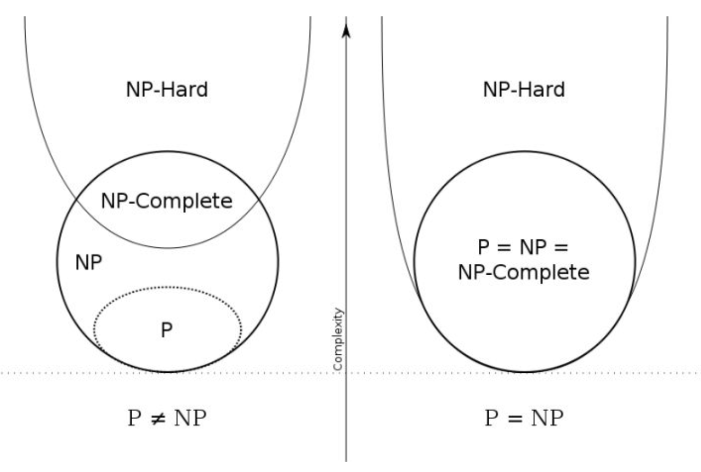

# NP完全问题 (NP-Completeness)  
NP完全问题(NP-C问题)，既完全多项式非确定性问题，是世界七大数学难题之一

**P问题：** Polynomial问题，可以在多项式时间复杂度内解决的问题。（多项式时间为$$O(n^k)$$，$$k$$为一常数值，依问题而定。）  
例如：n个数的排序（不超过O(n^2)）。  
**NP问题：** Non-deterministic Polynomial问题，可以在多项式的时间内被证实或证伪的非确定性问题。    
非确定性算法：非确定性算法将问题分解成猜测和验证两个阶段。算法的猜测阶段是非确定性的，算法的验证阶段是确定性的，它验证猜测阶段给出解的正确性。设算法A是解一个判定问题Q的非确定性算法，如果A的验证阶段能在多项式时间内完成，则称A是一个多项式时间非确定性算法。  
有些计算问题是确定性的，例如加减乘除，只要按照公式推导，按部就班一步步来，就可以得到结果。  
但是，有些问题是无法按部就班直接地计算出来。比如，找大质数的问题。有没有一个公式能推出下一个质数是多少呢？这种问题的答案，是无法直接计算得到的，只能通过间接的“猜算”来得到结果。这也就是非确定性问题。  而这些问题的通常有个算法，它不能直接告诉你答案是什么，但可以告诉你，某个可能的结果是正确的答案还是错误的。这个可以告诉你“猜算”的答案正确与否的算法，假如可以在多项式（polynomial）时间内算出来，就叫做多项式非确定性问题。  
**NP-Hard问题：** 任何一个NP问题，都能在多项式时间内简化成的某个问题，那么这个问题就是一个NP-Hard问题。  
**NPC问题：** 完全多项式非确定性问题，简称NP完全问题。它既是NP问题，又是NP-Hard问题。  

| 问题类型 | 是否能在多项式时间内求解 | 是否能在多项式时间内验证 |
| :------------- | :------------- | :------------- |
| P | 是 | 是 |
| NP | 是or否 | 是 |
| NP-C | 未知 | 是 |

### 相互关系：
显然，所有P问题都是NP问题，反之则不一定。NPC问题是NP问题的子集，也是P问题和NP问题的差异所在。
** NP=P? ** 人们发现，所有的完全多项式非确定性问题，都可以转换为一类叫做满足性问题的逻辑运算问题。既然这类问题的所有可能答案，都可以在多项式时间内计算，人们于是就猜想，是否这类问题存在一个确定性算法，可以在多项式时间内直接算出或是搜寻出正确的答案呢?这就是著名的NP=P?的猜想。  
如果找到一个多项式内能被解决的NPC问题的解决方法，那么P=NP。

###  NP完全问题近似解法
完全多项式非确定性问题可以用穷举法得到答案，一个个检验下去，最终便能得到结果。但是这样算法的复杂程度，是指数关系，因此计算的时间随问题的复杂程度成指数的增长，很快便变得不可计算了。常见的近似解法有：  
* 近邻法  
* 插入法  
* 模拟退火算法  
* 遗传算法  
* 折叠神经网络算法  

### 识别NP完全问题
NP完全问题无处不在!如果能够判断出要解决的问题属于NP完全问题就好了，这样就不用去寻找完美的解决方案，而是使用近似算法即可。但要判断问题是不是NP完全问题很难，易于 解决的问题和NP完全问题的差别通常很小。例如，前面讨论了最短路径，你知道如何找出从A点到B点的最短路径。但如果要找出经由指定几个点的的最短路径，就是旅行商问题——NP完全问题。  
简言之， 没办法判断问题是不是NP完全问题，但还是有一些蛛丝马迹可循的。  
* 元素较少时算法的运行速度非常快，但随着元素数量的增加，速度会变得非常慢。
* 涉及“所有组合”的问题通常是NP完全问题。
* 不能将问题分成小问题，必须考虑各种可能的情况。这可能是NP完全问题。
* 如果问题涉及序列(如旅行商问题中的城市序列)且难以解决，它可能就是NP完全问题。
* 如果问题涉及集合(如广播台集合)且难以解决，它可能就是NP完全问题。
* 如果问题可转换为集合覆盖问题或旅行商问题，那它肯定是NP完全问题。
