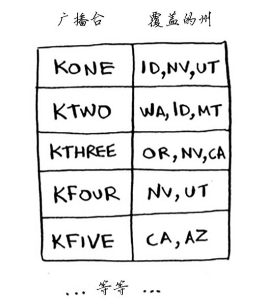
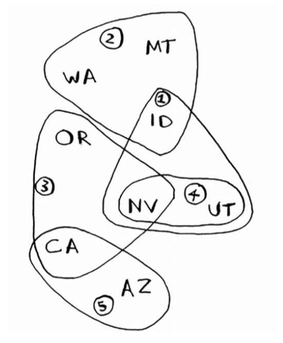

# 集合覆盖问题  

（摘自[《算法图解》](http://www.ituring.com.cn/book/1864)）  

假设你办了个广播节目，要让全美50个州的听众都收听得到。为此，你需要决定在哪些广播台播出。
在每个广播台播出都需要支付费用，因此你力图在尽可能少的广播台播出。现有广播台名单如下。  
  
每个广播台都覆盖特定的区域，不同广播台的覆盖区域可能重叠。  
  
如何找出覆盖全美50个州的最小广播台集合呢?听起来很容易，但其实非常难。具体方法如下。  
(1) 列出每个可能的广播台集合，这被称为幂集(power set)。可能的子集有$$2^n$$个。  
(2) 在这些集合中，选出覆盖全美50个州的最小集合。  
问题是计算每个可能的广播台子集需要很长时间。由于可能的集合有$$2^n$$个，因此运行时间为$$O(2^n)$$。如果广播台不多，只有5~10个，这是可行的。但如果广播台很多，结果将如何呢?随着广播台的增多，需要的时间将激增。  
没有任何算法可以足够快地解决这个问题!怎么办呢?  
### 近似算法
  ++贪婪算法++可化解危机!使用下面的贪婪算法可得到非常接近的解。  
1. 选出这样一个广播台，即它覆盖了最多的未覆盖州。即便这个广播台覆盖了一些已覆盖 的州，也没有关系。  
2. 重复第一步，直到覆盖了所有的州。  

这是一种近似算法(approximation algorithm)。在获得精确解需要的时间太长时，可使用近似算法。  
判断近似算法优劣的标准如下:   
* 速度有多快;  
* 得到的近似解与最优解的接近程度。   
贪婪算法是不错的选择，它们不仅简单，而且通常运行速度很快。在这个例子中，贪婪算法
的运行时间为$$O(n^2)$$，其中$$n$$为广播台数量。

参考代码：

```python
states_needed = set(["mt", "wa", "or", "id", "nv", "ut", "ca", "az"])  #需要覆盖的州

stations = {} #
stations["kone"] = set(["id", "nv", "ut"])
stations["ktwo"] = set(["wa", "id", "mt"])
stations["kthree"] = set(["or", "nv", "ca"])
stations["kfour"] = set(["nv", "ut"])
stations["kfive"] = set(["ca", "az"])

final_stations = set() # 使用一个集合来存储最终选择的广播台

while states_needed:
  best_station = None # 最佳广播台，覆盖了最多的未覆盖的州
  states_covered = set() # 最佳广播台所覆盖的所有未覆盖的州
  for station, states in stations.items(): # 循环迭代每个广播台并确定它是否最佳的广播台
    covered = states_needed & states # 取交集，即当前广播台所覆盖的所有未覆盖的州
    if len(covered) > len(states_covered): #比已知最佳广播台多
      best_station = station #将最佳广播台设置为当前广播台
      states_covered = covered

  states_needed -= states_covered # 更新需要覆盖的州states_needed
  final_stations.add(best_station) # 在for循环结束后将best_station添加到最终的广播台列表中

print(final_stations) # 打印final_stations
```
