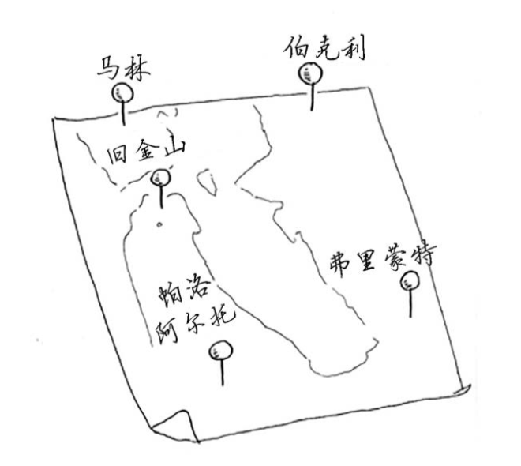
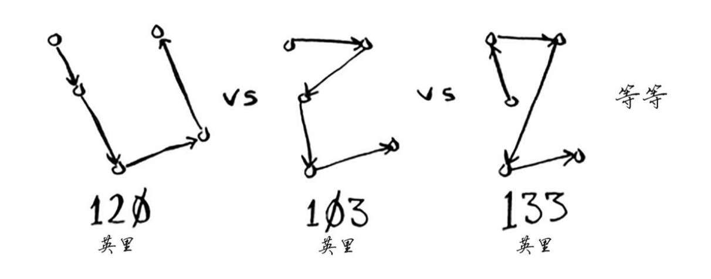
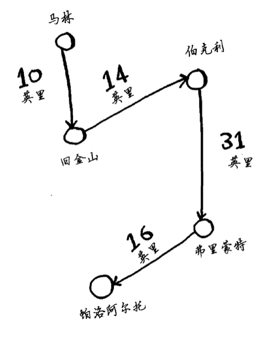

# 旅行商问题  

（摘自[《算法图解》](http://www.ituring.com.cn/book/1864)）  

有一位旅行商。 他需要前往5个城市。

这位旅行商(姑且称之为Opus吧)要前往这5个城市，同时要确保旅程最短。为此，可考虑 前往这些城市的各种可能顺序。

对于每种顺序，他都计算总旅程，再挑选出旅程最短的路线。5个城市有120种不同的排列方 式。因此，在涉及5个城市时，解决这个问题需要执行120次操作。涉及6个城市时，需要执行720 次操作(有720种不同的排列方式)。涉及7个城市时，需要执行5040次操作!
推而广之，涉及n个城市时，需要执行n!(n的阶乘)次操作才能计算出结果。因此运行时间 为O(n!)，即阶乘时间。除非涉及的城市数很少，否则需要执行非常多的操作。如果涉及的城市 数超过100，根本就不能在合理的时间内计算出结果——等你计算出结果，太阳都没了。

旅行商问题和集合覆盖问题有一些共同之处:你需要计算所有的解，并从中选出最小/最短 的那个。这两个问题都属于NP完全问题。
NP完全问题的简单定义是，以难解著称的问题，如旅行商问题和集合覆盖问题。很多非常 聪明的人都认为，根本不可能编写出可快速解决这些问题的算法。

**近似求解**

对旅行商问题来说，什么样的近似算法不错呢?能找到较短路径的算法就算不错。在继续 往下阅读前，看看你能设计出这样的算法吗?
我会采取这样的做法:随便选择出发城市，然后每次选择要去的下一个城市时，都选择还 没去的最近的城市。假设旅行商从马林出发。  

  

总旅程为71英里。这条路径可能不是最短的，但也相当短了。
