# 二叉树 (Binary tree)

**二叉树** 是每个结点最多有两个子树的树结构。通常子树被称作“左子树”（left subtree）和“右子树”（right subtree）。  

> 二叉树的遍历：  
* 先序遍历（先根次序遍历）  
首先访问根，再先序遍历左（右）子树，最后先序遍历右（左）子树
* 中序遍历（中根次序遍历）  
首先中序遍历左（右）子树，再访问根，最后中序遍历右（左）子树
* 后序遍历（后根次序遍历）  
首先后序遍历左（右）子树，再后序遍历右（左）子树，最后访问根

### 二叉树的分类：  
>**满二叉树**：每一层节点都达到最大个数，所有叶子节点都在最后一层，总节点数为 2^k-1，叶子节点为2^(k-1)个。  
>
>**完全二叉树**：除了最后一层，其他每一层的结点数都达到最大个数，且最后一层的叶子结点都是从左到右依次排布。  
>
>**平衡二叉树**：左右两个子树的高度差的绝对值不超过1，并且左右两个子树都是一棵平衡二叉树。  

>**二叉查找树**：又称为二叉搜索树或二叉排序树。  
每个节点的值，都大于左子树中任意节点的值，而小于右子树中任意节点的值。  
>  
>**AVL树**：最先发明的自平衡二叉查找树。  
>  
>**红黑树**：是一种自平衡二叉查找树，典型应用是关联数组的实现。  
>  
>**哈夫曼树(Huffman Tree)**：也称最优二叉树，是一类带权路径长度最短的树。  

 

以下是二叉查找树示例图，摘自《我的第一本算法书》  

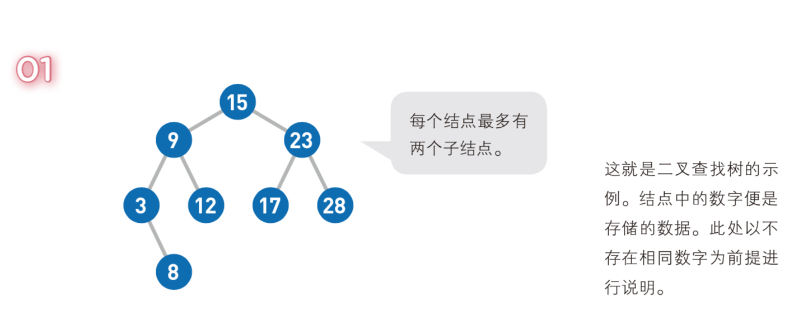

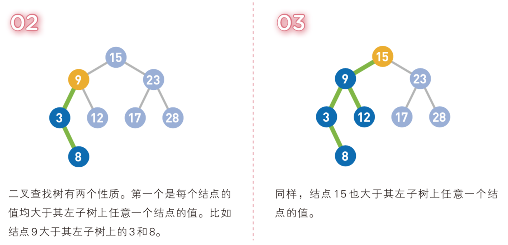

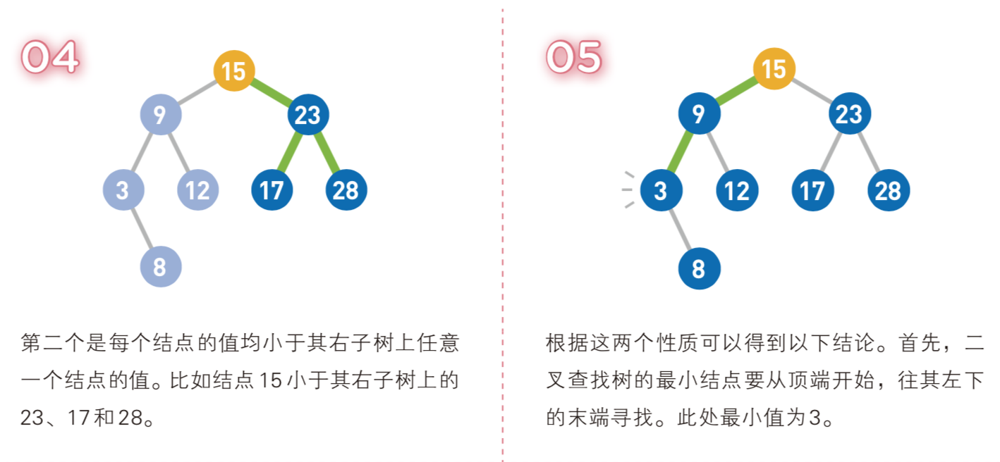

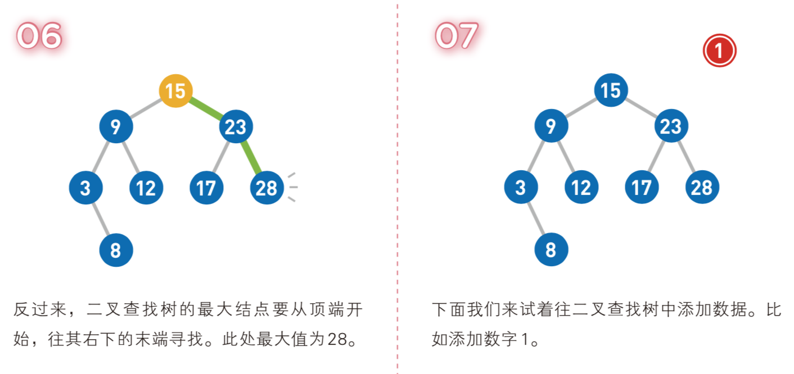

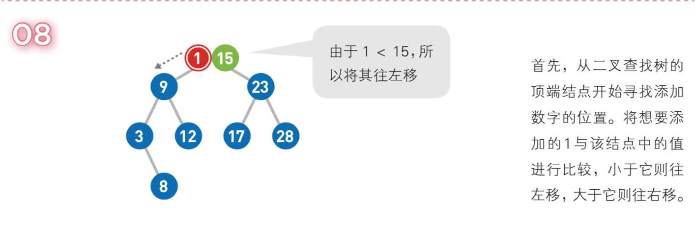

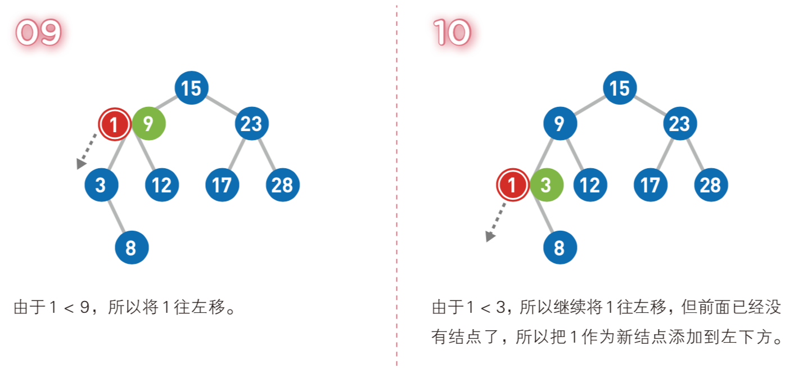

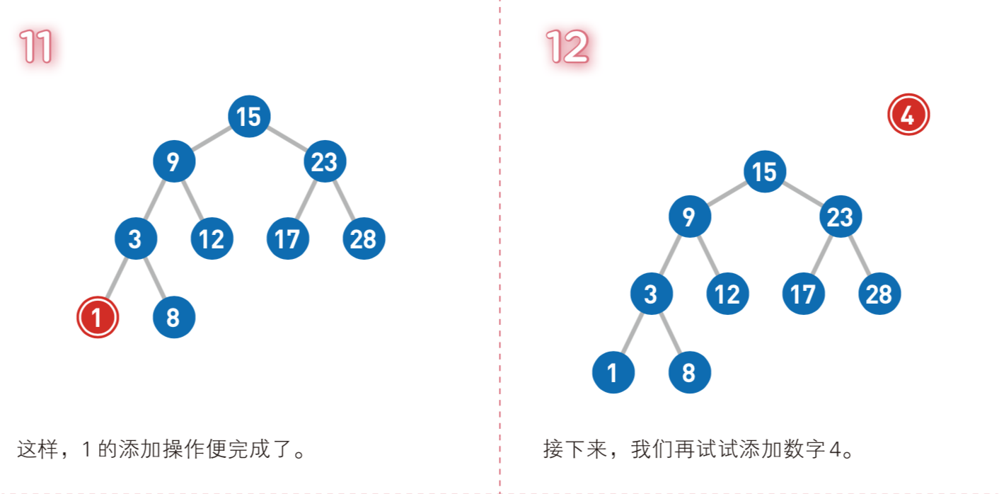

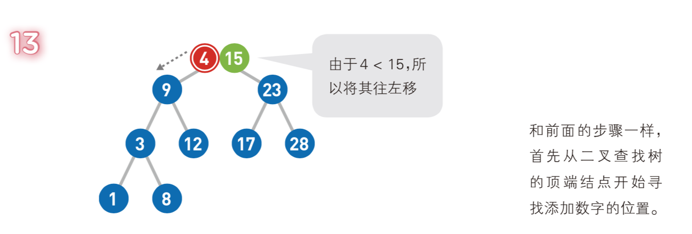

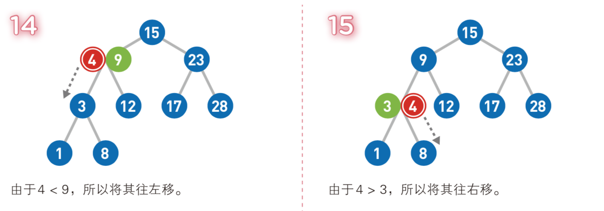

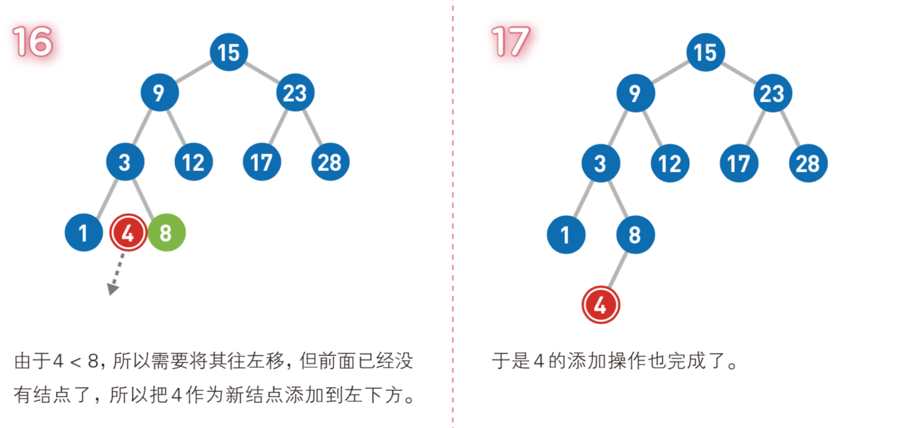

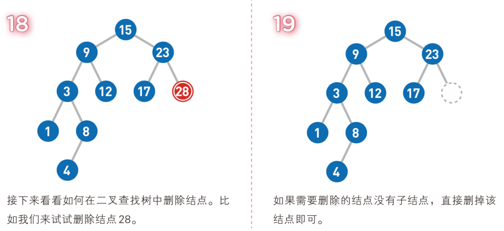

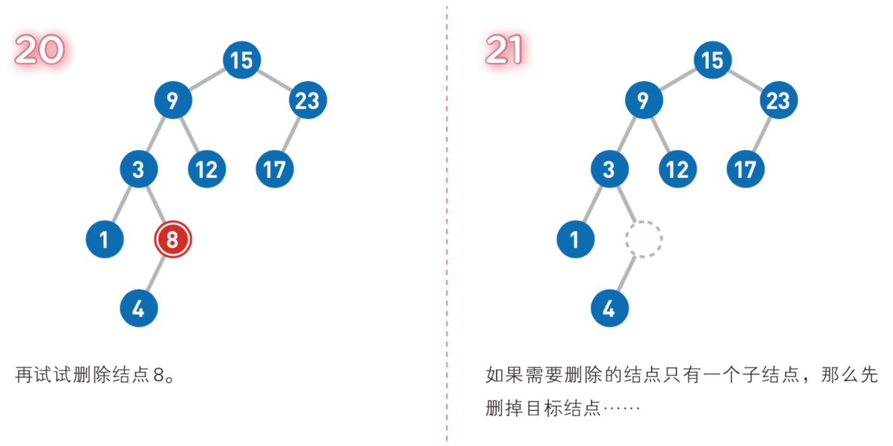

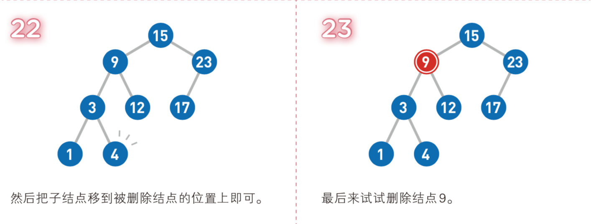

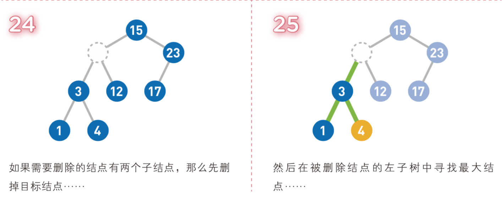

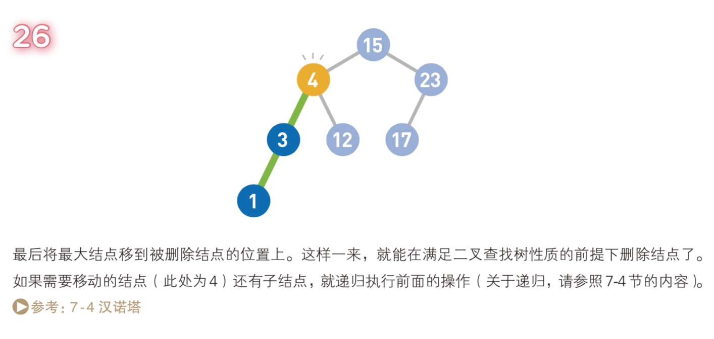

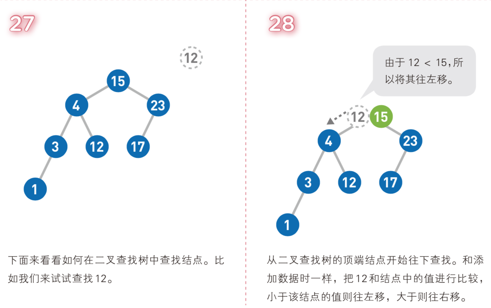

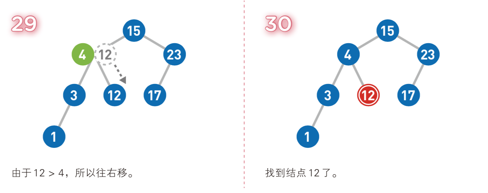

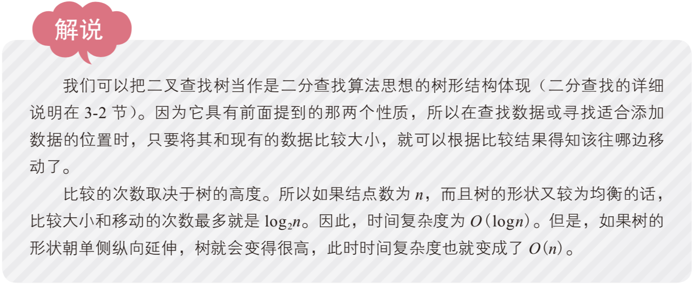
