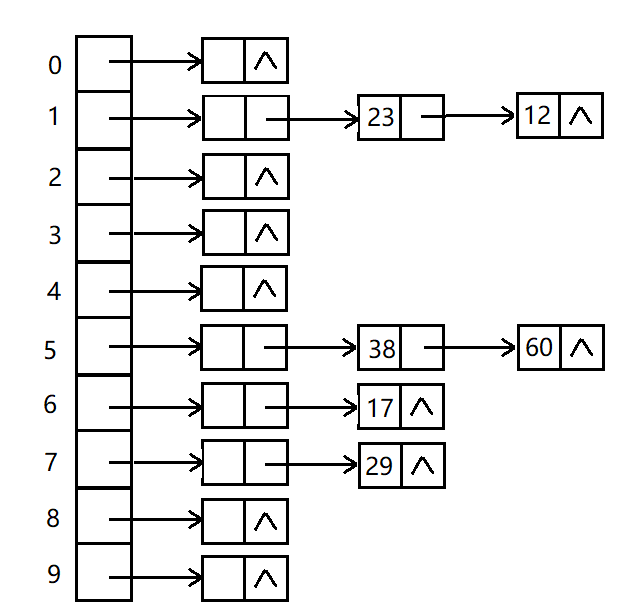

# 哈希表 (Hash table)
哈希表，也称散列表、散列映射、映射、字典、关联数组。它存储的是由键(key)和值(value)组成的数据。  
它通过哈希函数把输入的键映射成一个数字索引，把数据存到数组表中的对应位置中。查找时，同样将输入的键映射成一个数字索引，从表中对应位置读取数据，以此加快查找的速度。运行时间为O(1)。

哈希函数总是将相同的输入映射成相同的数字。  
哈希函数尽可能将不同的的输入映射到不同的数字（也可能会重复，但一个好的哈希函数应该尽量避免重复）。  
在存储数据的过程中，万一映射的索引重复，也叫发生冲突，可以利用链表在已有数据的后面插入新数据来解决冲突，这种方法称为“拉链法”或“链地址法”。读取数据时，道理也一样，在索引位置对应空间的的链表中进行线性查找。  
哈希表拉链法图示：  

除了链地址法以外，还有几种解决冲突的方法。其中，应用较为广泛的是“开放地 址法”。这种方法是指当冲突发生时，立刻计算出一个候补地址(数组上的位置)并将数 据存进去。如果仍然有冲突，便继续计算下一个候补地址，直到有空地址为止。可以通 过多次使用哈希函数或“线性探测法”等方法计算候补地址。

使用哈希表时，如果分配的数组的空间太小，就容易发生冲突，线性查找的使用频率也会更高;反过来，如果数组的空间太大，就会出现很多空箱子，造成内存的浪费。因此，给数组设定合适的空间非常重要。一般来说，哈希表的长度需要根据元素的数量的调整，通常在填装因子(即元素总数量/数组长度)大于0.7时，就调整长度。每次调整长度时，重新用哈希函数将所有元素插入到新表中。
