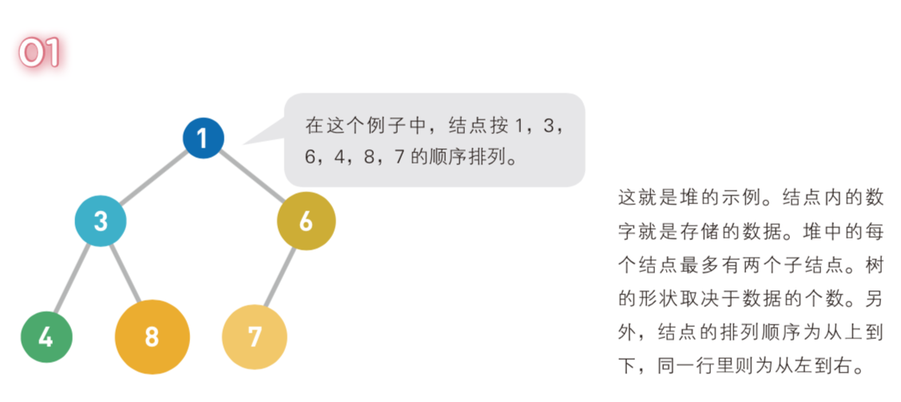
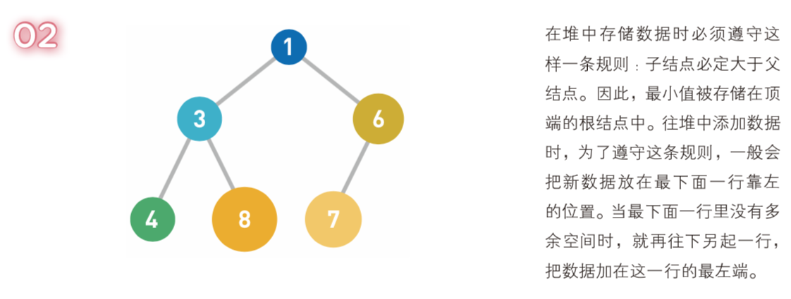
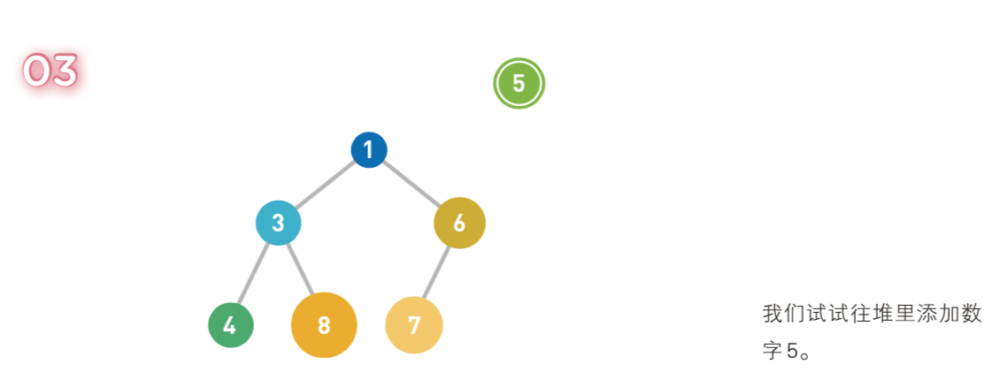
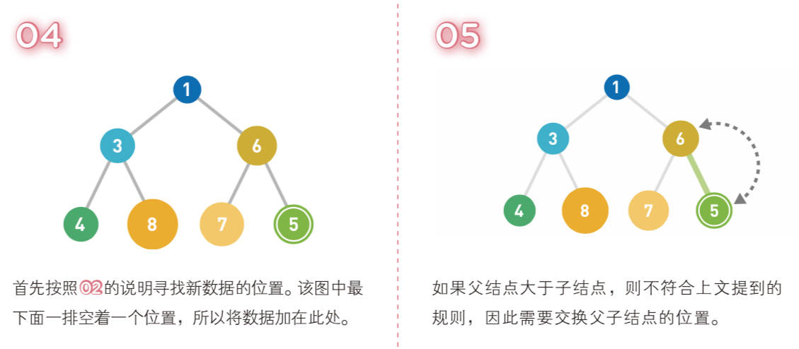
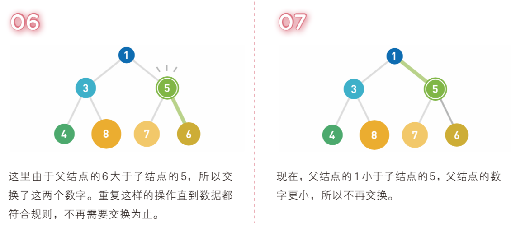
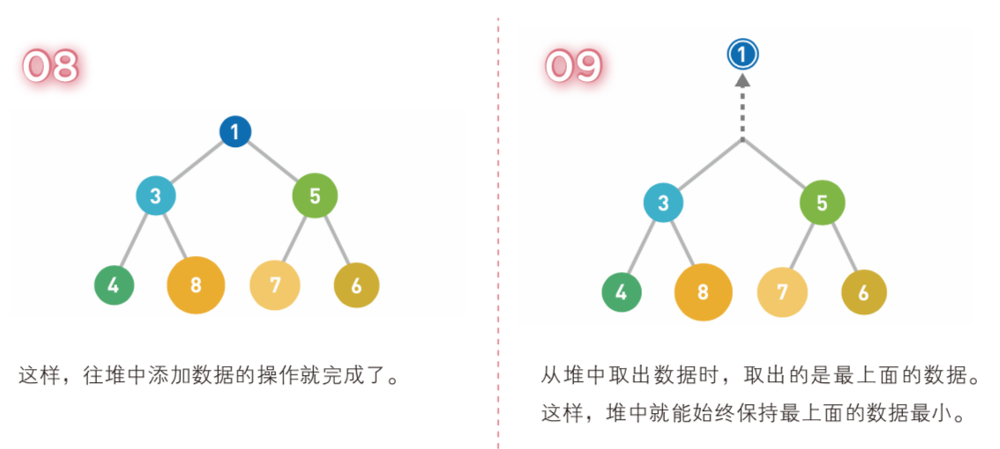
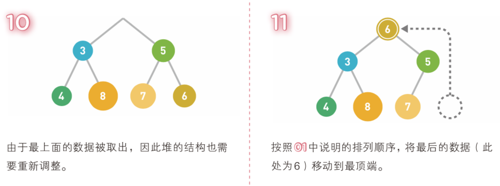
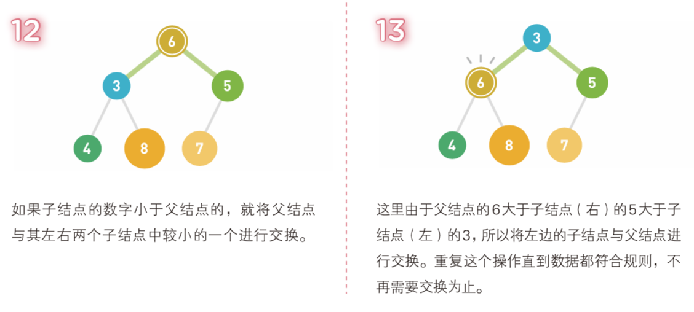
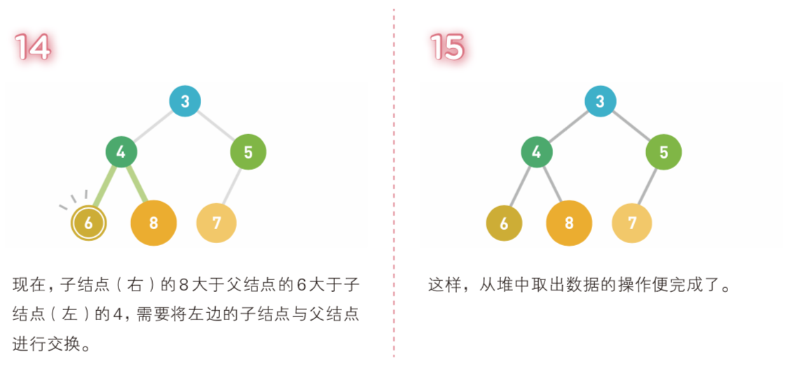
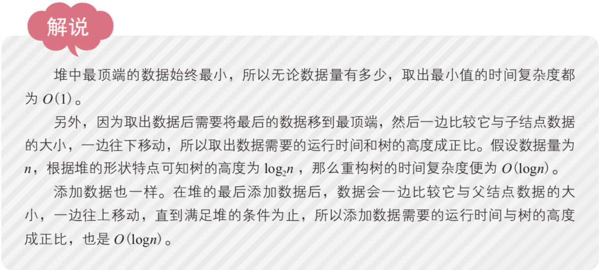

# 堆 (Heap)
堆通常是一个可以被看做一棵树的数组对象。
堆中的每个结点最多有两个子结点。结点的排列顺序为从上到 下，同一行里则为从左到右，是一棵完全二叉树。

堆分为两种，最大堆和最小堆，两者的差别在于节点的排序方式。  
最大堆：也称大根堆，要求父节点的值比每一个子节点的值都要大。
最小堆：也称小根堆，要求父节点的值比每一个子节点的值都要小。

以下是最小堆的示例图，摘自[《我的第一本算法书》](http://www.ituring.com.cn/book/2464)

