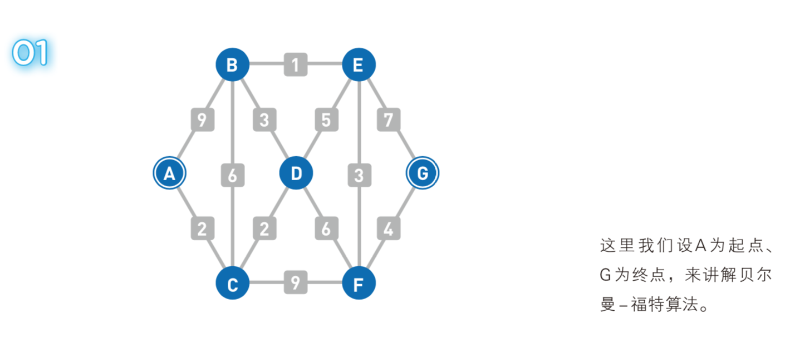

# 贝尔曼-福特算法 (Bellman-Ford algorithm)

贝尔曼-福特算法(Bellman-Ford)是由理查德·贝尔曼(Richard Bellman) 和 莱斯特·福特 创立的，求解单源最短路径问题的一种算法。有时候这种算法也被称为 Moore-Bellman-Ford 算法，因为 Edward F. Moore 也为这个算法的发展做出了贡献。它的原理是对图进行V-1次松弛操作，得到所有可能的最短路径。其优于迪科斯彻算法的方面是边的权值可以为负数、实现简单，缺点是时间复杂度过高，高达O(VE)。但算法可以进行若干种优化，提高了效率。  

以下是贝尔曼-福特算法的示例图，摘自[《我的第一本算法书》](http://www.ituring.com.cn/book/2464)

