# 狄克斯特拉算法 (Dijkstra's algorithm)

Dijkstra算法是由荷兰计算机科学家狄克斯特拉（Dijkstra）于1959 年提出的，因此又叫狄克斯特拉算法，或迪杰斯特拉算法。是从一个顶点到其余各顶点的最短路径算法，解决的是有向图中最短路径问题。

以下是狄克斯拉算法的示例图，摘自[《我的第一本算法书》](http://www.ituring.com.cn/book/2464)

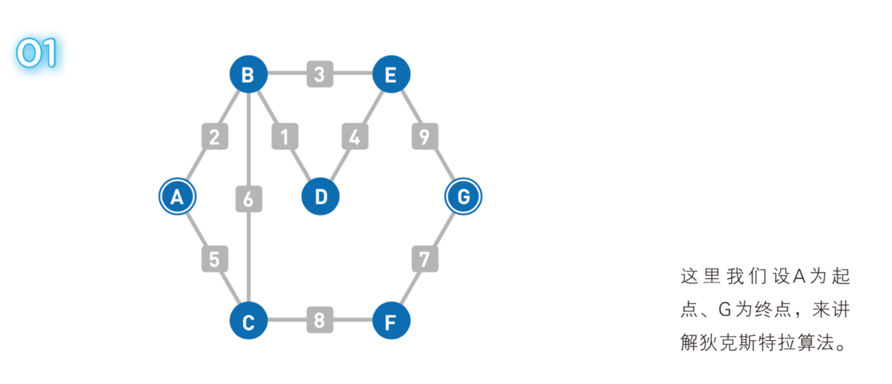

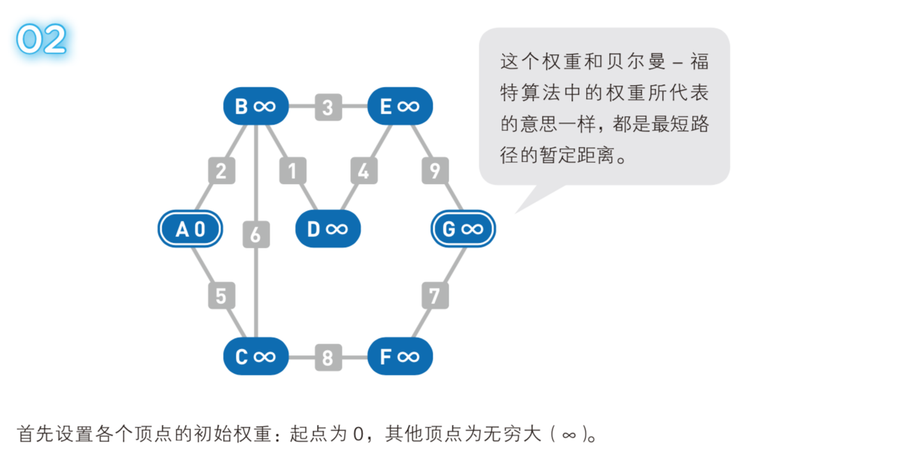

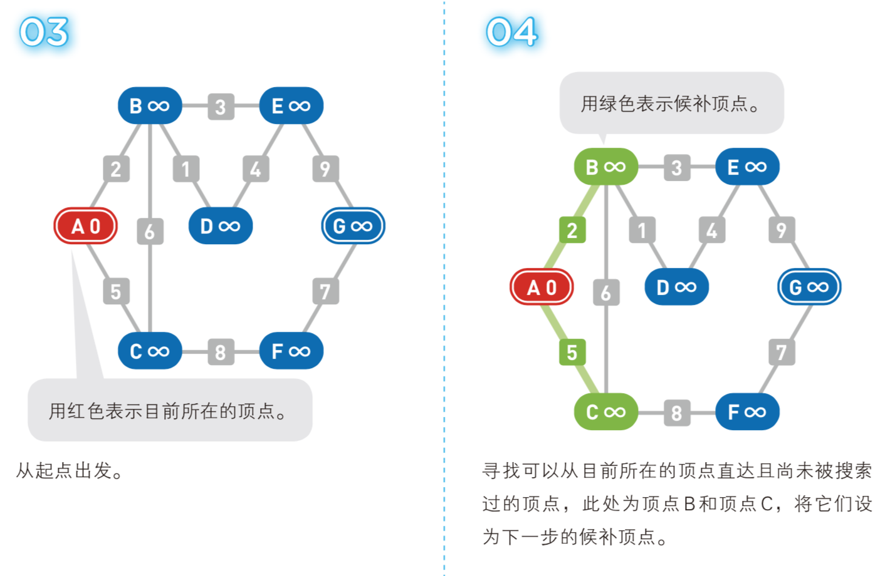

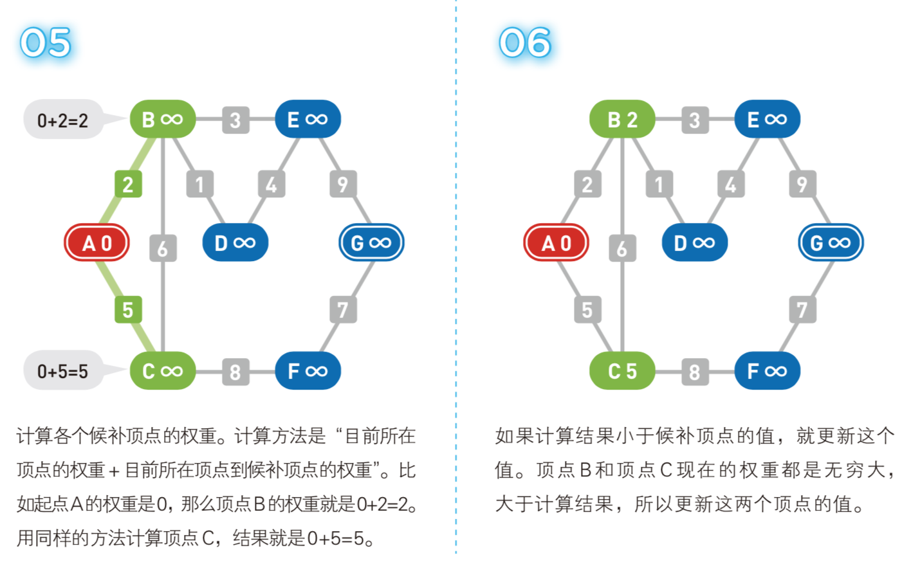

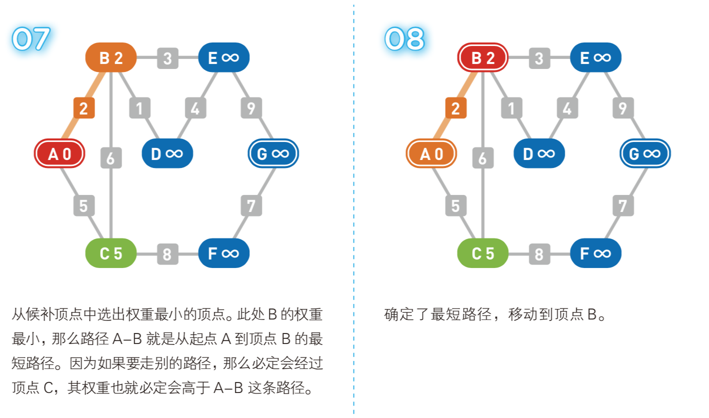

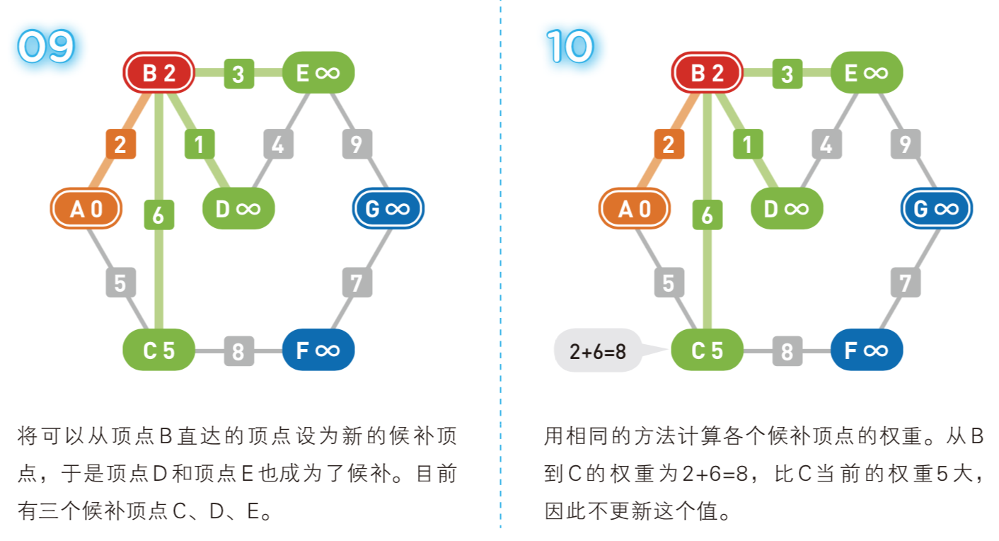

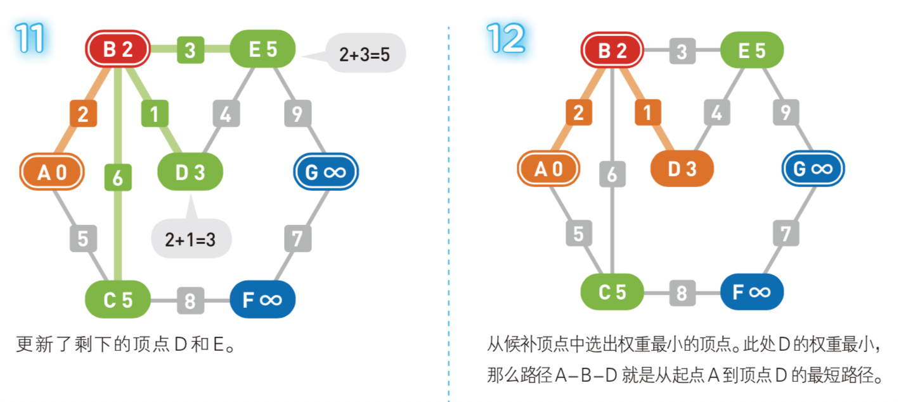

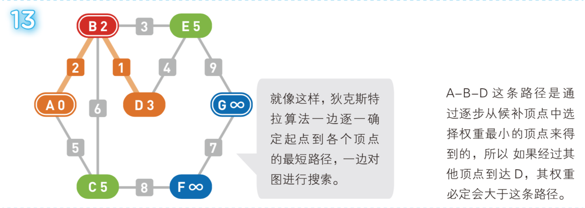

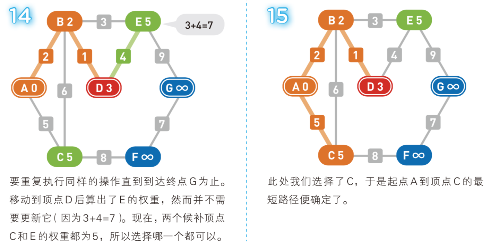

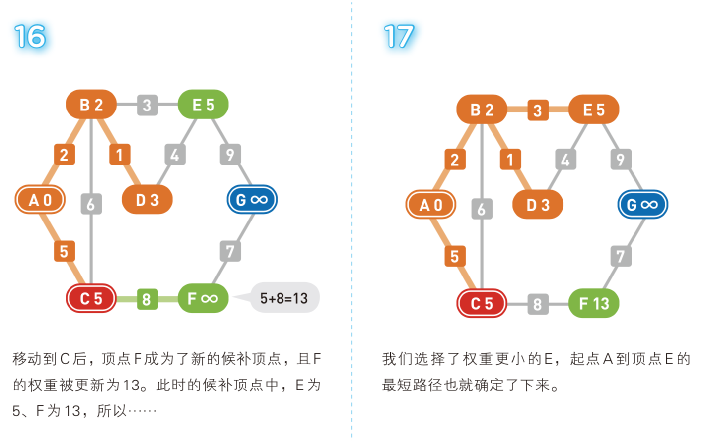

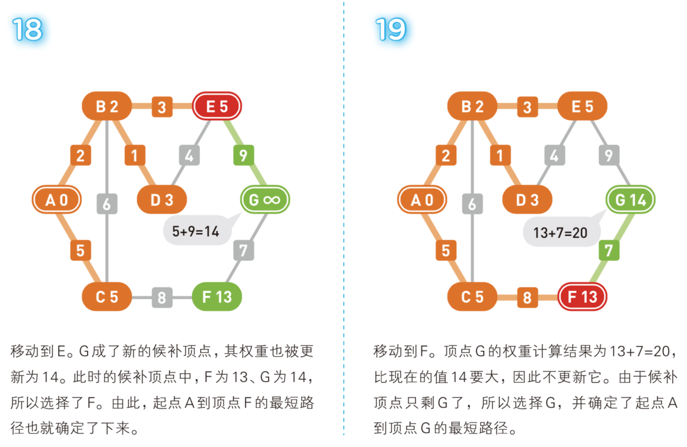

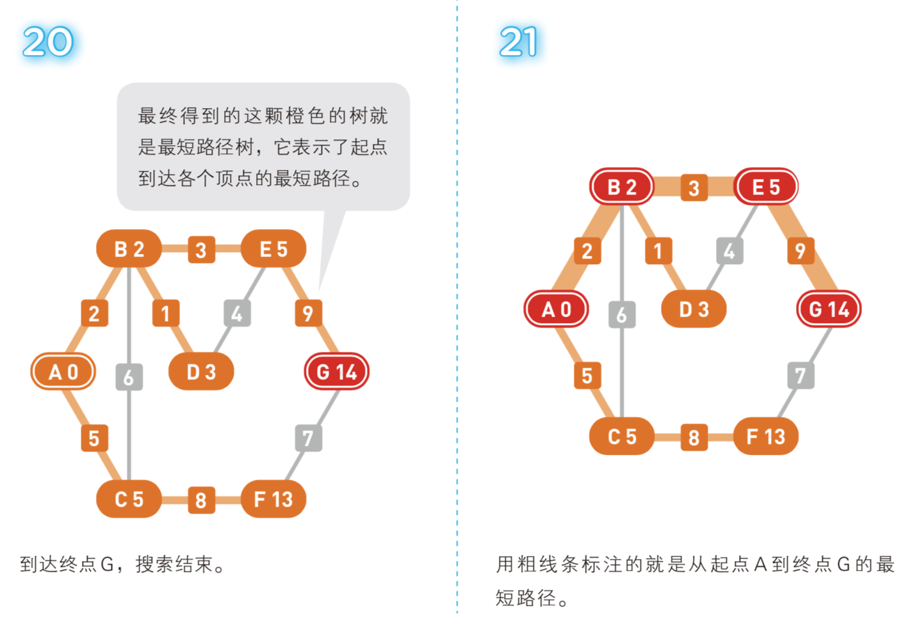

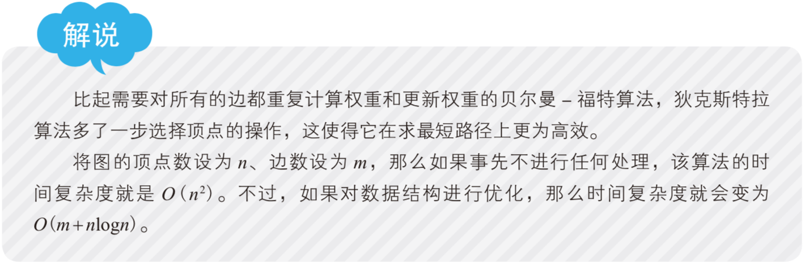

<br>
<br>

### 代码实现  
参考[《算法图解》](http://www.ituring.com.cn/book/1864)  
对上图做了python实现，并扩充支持指定起始节点和终止节点。

```python
#需要三张散列表：
#graph储存图；
#costs存储每个节点的从起始节点出发所需要的最小开销
#parents储存每个节点的父节点

#定义图。上图虽是无向图，这里做了有向图的兼容，方便扩展和修改图。
graph = {}
graph['A'] = {}
graph['A']['B'] = 2
graph['A']['C'] = 5
graph['B'] = {}
graph['B']['A'] = 2
graph['B']['C'] = 6
graph['B']['D'] = 1
graph['B']['E'] = 3
graph['C'] = {}
graph['C']['A'] = 5
graph['C']['B'] = 6
graph['C']['F'] = 8
graph['D'] = {}
graph['D']['B'] = 1
graph['D']['E'] = 4
graph['E'] = {}
graph['E']['B'] = 3
graph['E']['D'] = 4
graph['E']['G'] = 9
graph['F'] = {}
graph['F']['C'] = 8
graph['F']['G'] = 7
graph['G']={}
graph['G']['E'] = 9
graph['G']['F'] = 7

#定义消费表
costs = {}
infinity = float("inf")  # 无穷大
costs['A'] = infinity
costs['B'] = infinity
costs['C'] = infinity
costs['D'] = infinity
costs['E'] = infinity
costs['F'] = infinity
costs['G'] = infinity

#父节点表
parents = {}
parents['A'] = None
parents['B'] = None
parents['C'] = None
parents['D'] = None
parents['E'] = None
parents['F'] = None
parents['G'] = None

#已处理过的节点
processed = []

#在未处理过的节点中，找出开销最小的节点
def find_lowest_cost_node(costs):
    lowest_cost = float('inf')
    lowest_cost_node = None
    for node in costs:
        cost = costs[node]
        if cost < lowest_cost and node not in processed:
            lowest_cost = cost
            lowest_cost_node = node
    return lowest_cost_node


def calculatePath(begin, end):    
    costs[begin] = 0  #起始节点开销置为0
    node = find_lowest_cost_node(costs) #在未处理过的节点中，找出开销最小的节点
    while node is not None:
        cost = costs[node]  #当前节点开销
        neighbors = graph[node]  #当前节点的邻居节点
        for n in neighbors.keys():  #遍历当前节点的所有邻居
            if n in processed: #忽略已处理过的节点
                continue
            #如果经过当前节点前往邻居的开销，比邻居节点在消费表中的开销记录小，则更新邻居在消费表中的开销。
            #同时将该邻居的父节点设置为当前节点
            new_cost = cost + neighbors[n]
            if costs[n] > new_cost:
                costs[n] = new_cost
                parents[n] = node
        processed.append(node)  #标记当前节点已经处理过
        node = find_lowest_cost_node(costs) #继续找下一个未处理过的最小开销节点


    path = [] #节点路径
    #从最后一个节点开始，反向找它的父节点，直到起始节点
    last_node = end
    path.append(last_node)
    while last_node is not begin and last_node is not None:
        last_node = parents[last_node]
        path.append(last_node)
    path.reverse() #反转数组，就是起始节点到结束节点的路径
    print("->".join(path))
    print(costs[end])

calculatePath('A', 'G') #指定A为起始节点，G为终止节点。开始计算，并输出结果。

```
