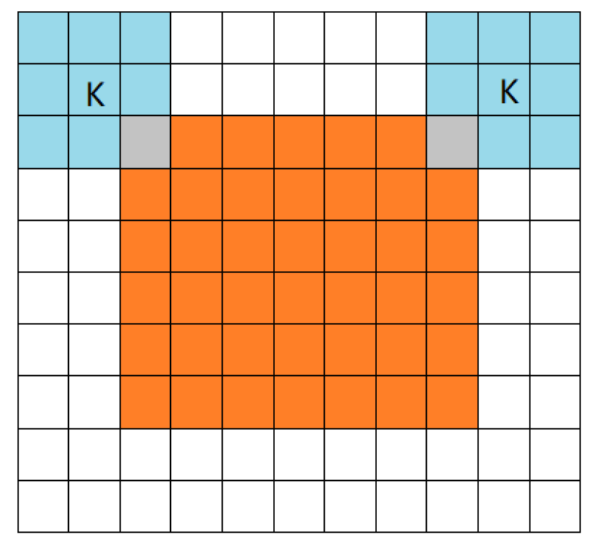

# 卷积神经网络 (Convolution Neural Network)  

**数学上卷积的定义**  

定义函数$$f$$和$$g$$的卷积$$(f*g)(n)$$ 如下:  
连续形式:  
$$(f*g)(n)= \int_{-\infty}^{\infty} f(\tau) g(n-\tau) d\tau$$  
离散形式:  
$$(f*g)(n)= \displaystyle\sum_{-\infty}^{\infty} f(\tau) g(n-\tau) d\tau$$  
对卷积这个名词的理解：所谓两个函数的卷积，本质上就是先将一个函数翻转，然后进行滑动叠加。在连续情况下，叠加指的是对两个函数的乘积求积分，在离散情况下就是加权求和，为简单起见就统一称为叠加。  
整体看来是这么个过程：  
翻转-->滑动-->叠加-->滑动-->叠加-->滑动-->叠加.....多次滑动得到的一系列叠加值，构成了卷积函数。  
卷积的“卷”，指的的函数的翻转，从g(t)变成g(-t)的这个过程;  
卷积的“积”，指的是积分/加权求和。  

**矩阵卷积运算**  
* 互相关(cross correlation):  
或叫协相关，是将输入数据与核的位置的元素相乘再求和。  
例如:输入数据$$\begin{bmatrix} 1 & 1 & 1 & 0 & 0 \\ 0 & 1 & 1 & 1 & 0 \\ 0 & 0 & 1 & 1 & 1 \\ 0 & 0 & 1 & 1 & 0 \\ 0 & 1 & 1 & 0 & 0 \end{bmatrix}$$ 跟核$$\begin{bmatrix} 1 & 0 & 1 \\ 0 & 1 & 0 \\ 1 & 0 & 1  \end{bmatrix}$$ 的互相关运算，得到 $$\begin{bmatrix} 4 & 3 & 4 \\ 2 & 4 & 3 \\ 2 & 3 & 4  \end{bmatrix}$$。过程如下图示:  
 

* 卷积  
先把核翻转180度，再与输入数据做互相关运算。  
 

 

#### **但是，在深度学习文献中，习惯性把互相关操作叫做卷积，即省略了翻转操作，简化了运算，神经网络一样生效。**

 

### 过滤器filter  
也叫卷积核。常见几种过滤器:  
垂直边缘检测过滤器:$$\begin{bmatrix} 1 & 0 & -1 \\ 1 & 0 & -1 \\ 1 & 0 & -1 \end{bmatrix}$$  

水平边缘检测过滤器:$$\begin{bmatrix} 1 &  1 & 1 \\ 0 & 0 & 0 \\ -1 & -1 & -1 \end{bmatrix}$$  

Sobel的过滤器:$$\begin{bmatrix} 1 & 0 & -1 \\ 2 & 0 & 2 \\ 1 & 0 & -1 \end{bmatrix}$$ 也是一种垂直边缘检测，它的优点在于增加了中间一行元素的权重，这使得结果的鲁棒性会更高一些。将其翻转90度就能得到对应水平边缘检测。  

Scharr过滤器:$$\begin{bmatrix} 3 & 0 & -3 \\ 10 & 0 & -10 \\ 3 & 0 & -3 \end{bmatrix}$$  也是一种垂直边缘检测，将其翻转90度就能得到对应水平边缘检测。  

锐化过滤器:$$\begin{bmatrix} -1 & -1 & -1 \\ -1 & 9 & -1 \\ -1 & -1 & -1 \end{bmatrix}$$  

浮雕过滤器:$$\begin{bmatrix} -1 & -1 & 0 \\ -1 & 0 & 1 \\ 0 & 1 & 1 \end{bmatrix}$$  

均值模糊过滤器:$$\begin{bmatrix} 0 & 0.2 & 0 \\ 0.2 & 0.2 & 0.2 \\ 0 & 0.2 & 0 \end{bmatrix}$$  

通过神经网络学习的过滤器: 这种过滤器对于数据的捕捉能力甚至可以胜过任何之前这些手写的过滤器。相比这种单纯的垂直边缘和水平边缘，它可以检测出45°或70°或73°，甚至是任何角度的边缘。所以将矩阵的所有数字都设置为参数，通过数据反馈，让神经网络自动去学习它们，我们会发现神经网络可以学习一些低级的特征，例如这些边缘的特征。  

### Padding    
如果我们有一个$$n \times n$$的图像，用$$f \times f$$的过滤器做卷积，那么输出的维度就是$$(n-f+1) \times (n-f+1)$$。在前面例子里个5×5的图像经过3×3卷积后,$$5-3+1=3$$，因此得到了一个3×3的输出。这样的话会有两个缺点:  
第一个缺点是每次做卷积操作，你的图像就会缩小;  
第二个缺点时，角落边缘的像素，只被一个输出所触碰或者使用，在输出中采用较少，意味着丢掉了图像边缘位置的许多信息。  

为了解决这些问题，你可以在卷积操作之前填充这幅图像。在这个案例中，你可以沿着图像边缘再填充一层像素。如果你这样操作了，那么5×5的图像就被你填充成了一个7×7的图像。如果你用3×3的图像对这个7×7的图像卷积，得到了一个尺寸和原始图像一样的5×5图像。同时，角落或图像边缘的信息发挥的作用较小的这一缺点就被削弱了。

习惯上，可以用0去填充。如果$$p$$是在周围都填充的像素层数（上面例子中$$p=1$$)，那么输出大小也就变成了: $$(n+2p-f+1) \times (n+2p-f+1)$$。  

根据填充像素$$p$$选择的不同情况，通常分为三种不同的卷积模式：  
**Valid模式 ($$p=0$$)**    
即不填充，也就是前面一开始的例子，此时filter全部在image里面进行卷积运算，卷积之后输出的尺寸变小,即$$(n-f+1) \times (n-f+1)$$。  
  

**Same模式 ($$p=(f-1)/2$$)**  
same模式也是最常见的模式，即filter的中心与image的边角重合时，以0填充, 卷积之后输出的图片尺寸能够保持不变(假定卷积核的步长为１)。
注:通常情况下,$$f$$为奇数，比如常见的过滤器是3x3或5x5，这样才有自然填充（$$p=(f-1)/2$$得到的自然是整数)，能确保得到和输入相同尺寸的输出。很小遇到$$f$$为偶数的情况，因为这样只能使用一些不对称填充。  
  

**Full模式 ($$p=f-1$$)**  
full模式的意思是，从filter和image刚相交开始做卷积,这种模式比较少见。    
  

### 卷积步长 (Stride)  
在卷积扫描过程中，卷积核每次移动几个步子，用$$s$$表示。  

卷积后，尺寸为$$\frac{n+2p - f}{s} + 1$$ 如果商不是一个整数，那么向下取整。也就是遵循一个惯例，当卷积核移动到了外面时，就不再进行相乘操作，继续下一行。

### 多通道图像的卷积计算过程  
**单个过滤器的3D卷积运算:**  
对于3通道的RGB图片，同样可以使用3通道的过滤器来进行卷积，然后把这三个过滤器结果加起来得到最终的图片。  
   
举个例子，如果你想检测图像红色通道的边缘，那么你可以将第一个过滤器设为 $$\begin{bmatrix}1 & 0 & - 1 \\ 1 & 0 & - 1 \\ 1 & 0 & - 1  \end{bmatrix} $$，和之前一样，而绿色通道全为0， $$\begin{bmatrix} 0& 0 & 0 \\ 0 &0 & 0 \\ 0 & 0 & 0 \end{bmatrix} $$，蓝色也全为0。如果你把这三个堆叠在一起形成一个3×3×3的过滤器，那么这就是一个检测垂直边界的过滤器，但只对红色通道有用。  

 

**多个过滤器的3D卷积运算:**  
将每个过滤器得到的结果，叠加在一起。  
 

用$$n_{W}^{[l]}$$表示第$$l$$层图像宽度  
$$n_{H}^{[l]}$$表示第$$l$$层图像高度度  
 $$n_{W}^{[l]} = \lfloor\frac{n_{W}^{\left\lbrack l - 1 \right\rbrack} +2p^{[l]} - f^{[l]}}{s^{[l]}} +1\rfloor $$  
$$n_{H}^{[l]} = \lfloor\frac{n_{H}^{\left\lbrack l - 1 \right\rbrack} +2p^{[l]} - f^{[l]}}{s^{[l]}} +1\rfloor $$  
用$$n_{c}^{[l]}$$表示第$$l$$层的图像通道数(或叫图像的深度)，则$$n_{c}^{[l]}$$等于所输入的卷积层的过滤器组个数  

### 单层卷积网络  
单层卷积网络的结构如下，其实这个和普通的神经网络是类似的,注意:  
$$W$$在这里代表滤波器组的参数值，$$*$$符号不是乘法而是代表卷积运算,激活函数g常用ReLu函数。    
$$Z^{[l]} = W^{[l]} * A^{[l]} + b$$  
$$A^{[l]} = g^{[l]}(Z^{[l]})$$  
  
对于上图例子,参数一共有多少个呢:  
3x3x3=27个，加上偏置1个，等于28个，两个过滤器一共56个参数。  
也就是不管图片多大，我们都只有56个参数，这样就大大减小了过拟合的问题。

**用矩阵乘法实现卷积计算:**
im2col（后详）

 

### 池化层 (Pooling layers)  
池化(pooling)，也叫下采样(down sampling)。它只是计算神经网络某一层的静态属性，不需要学习。    

**最大池化 (max pooling)**  
就是当过滤器窗口滑动过程中选择最大值。以最常见的2x2最大池化过滤器为例:    
  

**平均池化 (average pooling)**  
就是当过滤器窗口滑动过程中取平均值。用的较少。  
* 全局平均池化层（GAP，Global Average Pooling）  
(待补充)  

 

### 全连接层 (FC)  
全连接层（fully connected layers，FC），在整个卷积神经网络中起到“分类器”的作用。卷积取的是局部特征，需要再加上一个或多个全连接层，把以前的局部特征重新整合，再输出到最后的分类器或者回归。  

 
 

 
### 反向传播  
#### 池化层反向传播  
对于平均池化: 在反向传播的时候将某个元素平均分成n份分配给前一层，保证池化前后的梯度之和保持不变。  
对于最大池化: 前向传播的时候记录下最大值的位置，反向传播的时候把梯度传给这个位置，其他位置为0。
#### 卷积层反向传播  
以单通道极简情况为例:  
设输入$$A$$为3x3，单通道，卷积核$$W$$为2x2，输出$$Z$$为2xx2，单通道。  
$$ A \ * \  W = Z $$ 即:  
$$\begin{bmatrix} a_{11} & a_{12} & a_{13} \\ a_{21} & a_{22} & a_{23} \\ a_{31} & a_{32} & a_{33} \end{bmatrix}  *  \begin{bmatrix} w_{11} & w_{12}   \\ w_{21} & w_{22}  \end{bmatrix} =  \begin{bmatrix} z_{11} & z_{12}   \\ z_{21} & z_{22}  \end{bmatrix}$$ 

矩阵Z变形  
$$\begin{bmatrix} z_{11} \\ z_{12} \\ z_{21} \\ z_{22}  \end{bmatrix} = \begin{bmatrix} a_{11} w_{11} + a_{12} w_{12} + a_{21} w_{21} + a_{22} w_{22} \\ a_{12} w_{11} + a_{13} w_{12} + a_{22} w_{21} + a_{23} w_{22} \\ a_{21} w_{11} + a_{22} w_{12} + a_{31} w_{21} + a_{32} w_{22}  \\ a_{22} w_{11} + a_{23} w_{12} + a_{32} w_{21} + a_{33} w_{22}   \end{bmatrix} = \begin{bmatrix} a_{11} & a_{12} & a_{21} & a_{22}  \\ a_{12} & a_{13} & a_{22} & a_{23} \\ a_{21} & a_{22} & a_{31} & a_{32}  \\ a_{22} & a_{23} & a_{32} & a_{33}  \end{bmatrix} \begin{bmatrix} w_{11} \\ w_{12} \\ w_{21} \\ w_{22}  \end{bmatrix}$$  
所以，卷积运算可以转化为矩阵运算。即$$A$$、$$W$$、$$Z$$变形在之后对应矩阵变为$$\tilde{A}$$、$$\tilde{W}$$、$$\tilde{Z}$$，则:  
$$ \tilde{A} \cdot \tilde{W} = \tilde{Z}$$  
$$Z$$和$$W$$可以直接变形转成$$\tilde{Z}$$和$$\tilde{W}$$。但$$A$$需要特别处理，这个处理过程叫**im2col**（image to column），就是把卷积窗口中的数拉成一行，每行 $$k^2$$列，共$$(A.w-k+1)(A.h-k+1)$$ 行（一般$$A.w=A.h$$）。  

反向传播：  
记:$$\delta = \begin{bmatrix} \delta_{11} \\ \delta_{12} \\ \delta_{21} \\ \delta_{22}  \end{bmatrix} = \nabla \tilde{Z} = \begin{bmatrix} \nabla z_{11} \\ \nabla z_{12} \\ \nabla z_{21} \\ \nabla z_{22}  \end{bmatrix}$$

* $$\nabla A $$的计算  
$$\nabla \tilde{W} = \tilde{A}^T \cdot \nabla \tilde{Z}$$  
$$\nabla W$$ 可以直接通过$$\nabla \tilde{W} $$ 变形转换。  

* $$\nabla A $$的计算  
方法1.$$\nabla \tilde{A} = \nabla \tilde{Z} \cdot \tilde{W}^T $$  
但是从 $$\nabla \tilde{A} $$ 转回 $$\nabla A $$ 并非易事，im2col的逆映射计算复杂度高得不能接受，要计算$$\nabla A $$还得另寻它途。  
方法2.
对于每个$$a_{ij}$$，有:  
$$\nabla a_{11} = \delta_{11} w_{11} $$ (这里$$\delta_{11} = \nabla z_{11}$$, 下同)  
$$\nabla a_{12} = \delta_{11} w_{12} + \delta_{12} w_{11}$$  
$$\nabla a_{13} = \delta_{12} w_{12}$$  
$$\nabla a_{21} = \delta_{11} w_{21} + \delta_{21} w_{11} $$  
$$\nabla a_{22} = \delta_{11} w_{22} + \delta_{12} w_{21} + \delta_{21} w_{12} + \delta_{22} w_{11}$$  
$$\nabla a_{23} = \delta_{12} w_{22} + \delta_{22} w_{12}$$  
$$\nabla a_{31} = \delta_{21} w_{21}$$  
$$\nabla a_{32} = \delta_{21} w_{22} + \delta_{22} w_{21}$$  
$$\nabla a_{33} = \delta_{22} w_{22} $$  
那么:  
$$\nabla A = \begin{bmatrix} \nabla a_{11} & \nabla a_{12} & \nabla a_{13} \\  \nabla a_{21} & \nabla a_{22} & \nabla a_{33} \\  \nabla a_{31} & \nabla a_{32} & \nabla a_{33} \end{bmatrix} = \begin{bmatrix} 0 & 0 & 0 & 0 \\ 0 & \delta_{11} & \delta_{12} & 0 \\ 0 & \delta_{21} & \delta_{22} & 0 \\ 0 & 0 & 0 & 0 \end{bmatrix} * \begin{bmatrix} w_{22} & w_{21} \\ w_{12} & w_{11}  \end{bmatrix} $$  
即将$$\nabla Z$$ 进行padding操作四周填充一圈0, 将卷积核W翻转(旋转180度)，然后两者进行卷积。  

多通道的情况，以输入X输出Y为例，单通道和多通道对比图示:  

  
  

通常使用成熟的机器学习框架来实现，避免计算过程出错，同时优化性能。

 
 
 
