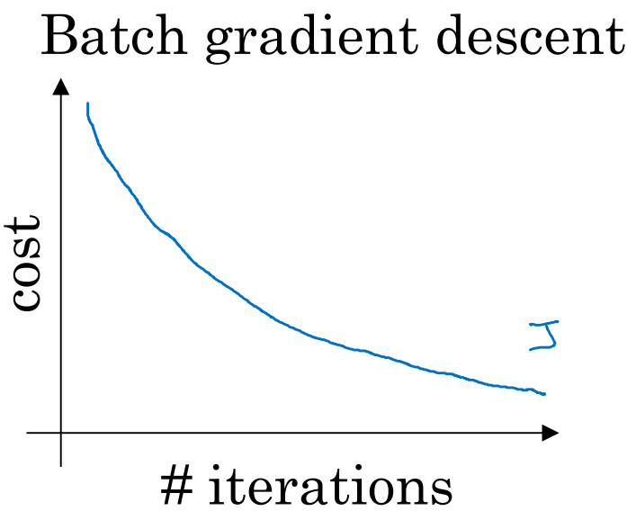
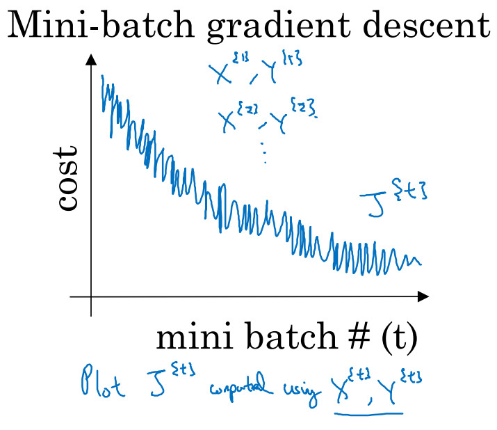
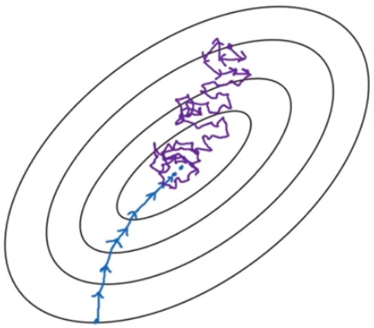
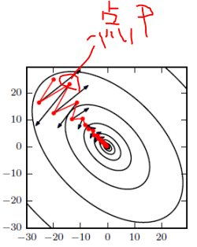

# 梯度下降

## 梯度消失/梯度爆炸（Vanishing / Exploding gradients）
深度神经网络训练的时候，采用的反向传播方式，该方式背后其实是链式求导，计算每层梯度的时候会涉及一些连乘操作，因此如果网络过深，那么如果连乘的因子大部分小于1，最后乘积可能趋于0；另一方面，如果连乘的因子大部分大于1，最后乘积可能趋于无穷。这就是所谓梯度消失与梯度爆炸。  

#### 权重初始化
如果权重一开始很小，信号到达最后也会很小；如果权重一开始很大，信号到达最后也会很大。
不合适的权重初始化会使得隐藏层的输入的方差过大,从而在经过sigmoid这种非线性层时离中心较远(导数接近0),因此过早地出现梯度消失。

1.初始化为小的随机数,如均值为0,方差为0.01的高斯分布:  
W=0.01 * np.random.randn(D,H)  
然而只适用于小型网络,对于深层次网络,权重小导致反向传播计算中梯度也小,梯度"信号"被削弱。

2.上面1中的分布的方差随着输入数量的增大而增大,我们可以通过方差规范化：$$ / np.sqrt(n)$$ ，维持输入、输出数据分布方差的一致性，从而更快地收敛。
把初始权重的方式为正态分布:  
$$w^{[l]} = np.random.randn( \text{shape}) * \text{np.}\text{sqrt}(\frac{1}{n^{[l-1]}})$$，$$n^{[l - 1]}$$就是喂给第$$l$$层神经单元的数量（即第$$l-1$$层神经元数量）。  

3.如果使用的是tanh函数，同样使用：
$$w^{[l]} = np.random.randn( \text{shape}) * \text{np.}\text{sqrt}(\frac{1}{n^{[l-1]}})$$  
这也称为Xavier初始化。

4.如果使用的是ReLU激活函数，设置方差为$$\frac{2}{n}$$效果更好，而不是$$\frac{1}{n}$$, 高斯分布权重初始化为:   
$$w^{[l]} = np.random.randn( \text{shape}) * \text{np.}\text{sqrt}(\frac{2}{n^{[l-1]}})$$  

 

## 梯度检验（Gradient checking）  

对于一个函数来说，通常有两种计算梯度的方式：  
- 数值梯度（numerical gradient）;  
数值梯度的优点是容易编程实现，不要求函数可微。有两种计算方法：  
(1)右边形式： $$\frac{J(\theta + \varepsilon) - J(\theta)}{\varepsilon}$$  
(2)双边形式：$$\frac{J(\theta + \varepsilon) - J(\theta -\varepsilon)}{2 \varepsilon} $$   双方形式比较准确。  
数值梯度的缺点是，通常是近似解，同时求解速度很慢。  

- 解析梯度（analytic gradient）;  
要求函数设计成可微的，可以快速地求解其解析梯度，同时这个梯度是确切解。

神经网络算法使用反向传播计算目标函数关于每个参数的解析梯度，由于涉及到的参数很多，很容易出现误差，导致最后迭代得到效果很差的参数值。为了确认代码中反向传播计算的梯度是否正确，可通过计算数值梯度，得到梯度的近似值$$d \theta_{approx}$$，然后和反向传播得到的梯度$$d \theta$$进行比较，若两者相差很小的话则证明反向传播的代码是正确无误的。
我们使用下式对数值梯度和解析梯度间的差值进行标准化:
$$ \frac{ {\| d \theta_{approx} - d \theta \|}_2 }{ \| d \theta_{approx} \| _2 +  \| d \theta \| _2 } $$  
如果差值$$ \le 10^{-7}$$，可以认为反向传播的实现代码没有问题；否则，就需要回去检查代码，可能有bug。

梯度检测方法的开销是非常大的，比反向传播算法的开销都大，所以一旦用梯度检测方法确认了梯度下降算法算出的梯度（或导数）值是正确的，那么就及时关闭它。  

 

## 梯度下降三种形式   

### BGD批量梯度下降法  (Batch Gradient Descent):  
也叫batch梯度下降法，每次同时处理整个训练集。  
使用batch梯度下降法时，每次迭代都需要历遍整个训练集，所以每次迭代成本都应该下降，如果成本函数$$J$$在某次迭代中增加了，那就有问题，很可能学习率太大。  
优点：全局最优解；易于并行实现；  
缺点：当样本数目很多时，训练过程会很慢。  
 

 

### MBGD小批量梯度下降法  (Mini-Batch Gradient Descent):  
也叫mini-bath梯度下降法。
当样本数$$m$$很大时，如果每次迭代都是对整个训练集求解所有样本的成本，那计算量非常大，训练速度很慢。所以，需要把训练集分割为小一点的子集训练，这些子集被取名为mini-batch，每个子集的样本数为mini-batch size。  
每次计算只处理一个子集 $$X^{\{t\}}$$和$$Y^{\{t\}}$$ （上标大括号t表示第t个子集），然后在接着计算下一个子集。  

使用mini-batch梯度下降法，
每次迭代中，你要处理的是 $$X^{\{t\}}$$ 和$$Y^{\{t\}}$$，如果要作出成本函数$$J^{\{t\}}$$的图，而$$J^{\{t\}}$$只和$$X^{\{t\}}$$，$$Y^{\{t\}}$$有关，也就是每次迭代都在训练不同的样本集，这样一来，对于$$X^{\{1\}}$$和$$Y^{\{1\}}$$可能计算成本会低一些，而对于$$X^{\{2\}}$$和$$Y^{\{2\}}$$有可能就计算成本比较高一些，所以：  
如果作出成本函数在整个过程中的图，则并不是每次迭代都是下降的，
会有很多的噪声，但总体走势朝下。   

MBGD梯度下降特点：速度比BSD快，比SGD慢；精度比BSD低，比SGD高。  

   

  

### SGD随机梯度下降法  (Stochastic gradient descent):    
当MBGD小批量梯度下降法的batchsize=1时，每个样本都是独立的mini-batch，一次只处理一个样本，此时的算法，叫随机梯度下降法。  
随机梯度下降法是有很多噪声的，平均来看，它最终会靠近最小值，不过有时候也会方向错误，因为随机梯度下降法永远不会收敛，而是会一直在最小值附近波动，但它并不会在达到最小值并停留在此。  
由于SGD每次迭代只使用一个训练样本，因此这种方法也可用作在线学习(online learning)。  
优点：训练速度快；  
缺点：准确度下降，并不是全局最优；不易于并行实现。  
  

## 梯度下降优化算法   
### Momentum 动量梯度下降法
动量算法直观效果解释：  
如图所示，红色为SGD+Momentum。黑色为SGD。可以看到黑色为典型Hessian矩阵病态的情况，相当于大幅度的徘徊着向最低点前进。
  而由于动量积攒了历史的梯度，如点P前一刻的梯度与当前的梯度方向几乎相反。因此原本在P点原本要大幅徘徊的梯度，主要受到前一时刻的影响，而导致在当前时刻的梯度幅度减小。
  直观上讲就是，要是当前时刻的梯度与历史时刻梯度方向相似，这种趋势在当前时刻则会加强；要是不同，则当前时刻的梯度方向减弱。  
   

**指数加权平均法的思想：**   
Momentum 梯度下降法, 就是计算了梯度的指数加权平均数，并以此来更新权重，它的运行速度几乎总是快于标准的梯度下降算法。
$$ v_{dW} = \beta v_{dW} + (1 - \beta) dW $$  
$$ v_{db} = \beta v_{db} + (1 - \beta) db $$  
$$W = W - \alpha v_{dw} $$  
$$b = b - \alpha v_{db} $$  

其中有两个超参数：学习率$$a$$以及参数$$\beta$$，$$\beta$$控制着指数加权平均数。  
$$\beta$$最常用的值是0.9，效果不错，是很棒的鲁棒数。那么关于偏差修正，所以你要拿$$v_{dW}$$和$$v_{db}$$除以$$1-\beta^{t}$$，实际上人们不这么做，因为10次迭代之后，因为你的移动平均已经过了初始阶段。实际中，在使用梯度下降法或动量梯度下降法时，人们不会受到偏差修正的困扰。  
当然$$v_{dW}$$初始值是0，要注意到这是和$$dW$$拥有相同维数的零矩阵，也就是跟$$W$$拥有相同的维数，$$v_{db}$$的初始值也是向量零，所以和$$db$$拥有相同的维数，也就是和$$b$$是同一维数。  

注：在某些资料上的计算公式相对简化，也省了$$(1-\beta)$$项，实际上两种效果差不多，但会影响到$$\alpha$$参数要根据$$\frac{1}{1 -\beta}$$相应变化，用起来不自然。  

### NAG算法 (Nesterov Accelerated Gradient)  
Nesterov是Momentum的变种，与Momentum唯一区别就是，计算梯度的不同，Nesterov先用当前的速度v更新一遍参数，在用更新的临时参数计算梯度，相当于添加了矫正因子的Momentum。在GD下，收敛比Momentum要更快一些，而在SGD下，Nesterov并没有任何改进。  

### AdaGrad算法  
自适应方法  

### RMSprop算法 (Root Mean Square Propagation)   
$$S_{dW} = \beta S_{dW} + (1 - \beta) {dW}^{2}$$  
$$S_{db} = \beta S_{db} + (1 - \beta) {db}^{2}$$  
$$W := W - \alpha \frac{dW}{\sqrt{S_{dW}}}$$  
$$b := b - \alpha \frac{db}{\sqrt{S_{db}}}$$  

### Adadelta算法　
Adadelta与Rmsprop类似，但是连初始的学习速率都不用设置

### Adam算法 (Adaptive Moment Estimation)  
Adam是Momentum算法和RMSprop算法的结合，是一种极其常用的学习算法，被证明能有效适用于不同神经网络，适用于广泛的结构。  
初始化:  
$$v_{dW} = 0$$，$$S_{dW} =0$$，$$v_{db} = 0$$，$$S_{db} =0$$  
计算指数加权平均数:  
$$v_{dW} = \beta_{1}v_{dW} + ( 1 - \beta_{1})dW$$  
$$v_{db} = \beta_{1}v_{db} + ( 1 - \beta_{1}){db}$$  
$$S_{dW} = \beta_{2}S_{dW} + ( 1 - \beta_{2}){(dW)}^{2}$$  
$$S_{db} = \beta_{2}S_{db} + (1 - \beta_{2}){(db)}^{2}$$  
一般使用Adam算法的时候，要计算偏差修正:  
$$v_{dW}^{corrected} = \frac{v_{dW}}{1 - \beta_{1}^{t}}$$    
$$v_{db}^{corrected} = \frac{v_{db}}{1 - \beta_{1}^{t}}$$  
$$S_{dW}^{corrected} = \frac{S_{dW}}{1 - \beta_{2}^{t}}$$  
$$S_{db}^{corrected} = \frac{S_{db}}{1 - \beta_{2}^{t}}$$  
更新参数:  
$$W:= W - \frac{a v_{dW}^{corrected}}{\sqrt{S_{dW}^{corrected}} +\varepsilon}$$  
$$b:=b - \frac{\alpha v_{db}^{corrected}}{\sqrt{S_{db}^{corrected}} +\varepsilon}$$　　

本算法中有很多超参数:  
学习率$$a$$很重要，也经常需要调试。  
$$\beta_{1}$$常用的缺省值为0.9。  
$$\beta_{2}$$ 推荐使用0.999。  
$$\varepsilon$$ 只是为了防止分母为0，具体值不重要，缺省值$$10^{-8}$$。　　

　　
