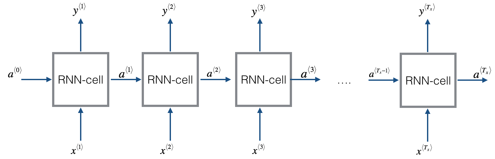
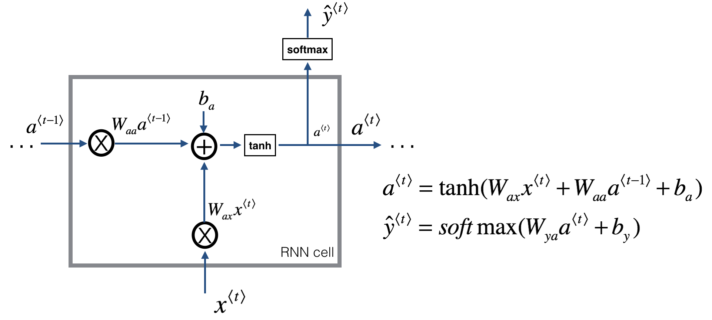
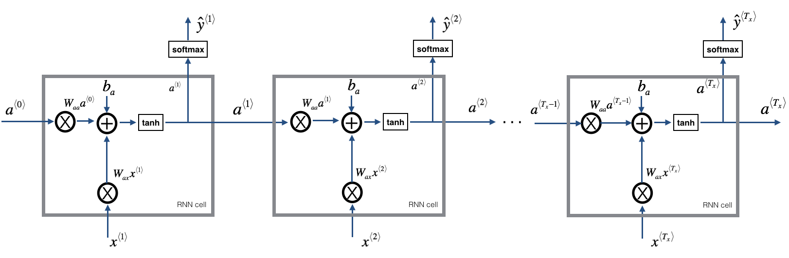
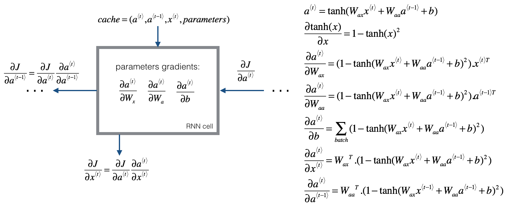
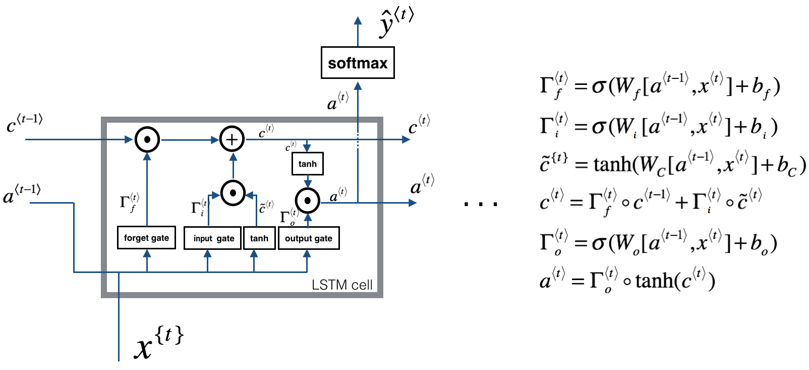
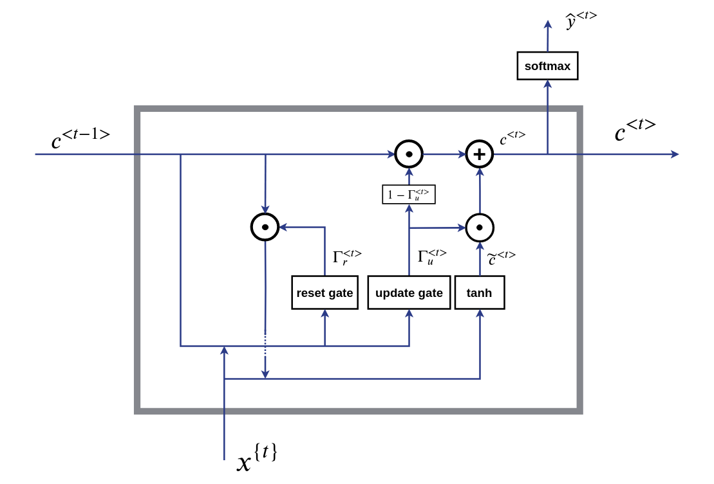
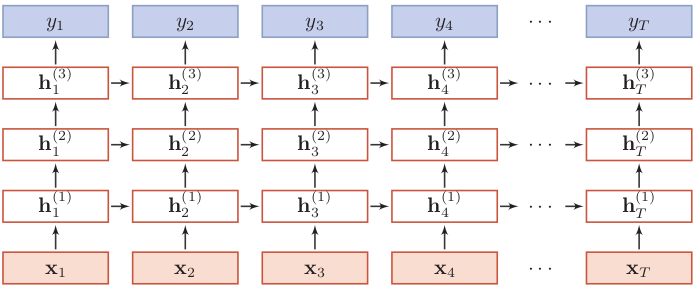
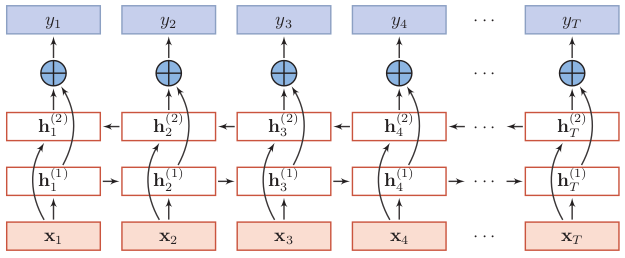

# 循环神经网络 (Recurrent Neural Network)  

递归神经网络（RNN）是两种反馈神经网络的总称，它可以处理变长输入。
一种是时间递归神经网络（Recurrent Neural Network），另一种是结构递归神经网络（Recursive Neural Network）。
一般地，时间递归神经网络被称为循环神经网络，而结果递归神经网络被简称为递归神经网络。

循环神经网络对于自然语言处理和其他序列任务非常有效，因为它们具有“记忆”功能。 它们可以一个一个地输入$$x^{<t>}$$（如单词），并且通过隐藏层激活从一个时间步传递到下一个时间步来记住一些信息/上下文，这允许单向RNN从过去获取信息来处理后面的输入，双向RNN可以从过去和未来中获取上下文。  

### 循环神经网络的基本结构  
  

**上标$$<t>$$表示第t个时间步，对应一个输入序列的索引。**  
例如，输入数据是句子，由9个单词组成，我们可以用9个特征集和来表示这9个单词，并按序列中的位置进行索引，$$x^{<1>}$$, $$x^{<2>}$$, ..., $$x^{<9>}$$ 表示第1个单词,第2个单词,...第9个单词。 $$t$$意味着它们是时序序列，但不论是否是时序序列，我们都将用$$t$$来索引序列中的位置。输出数据也是一样，我们还是用$$y^{<1>}$$, $$y^{<2>}$$, 等等一直到$$y^{<9>}$$来表示输出数据。  
**用$$T_{x}$$来表示输入序列的长度。**  
这个例子中输入是9个单词，所以$$T_{x}= 9$$。  
**用$$T_{y}$$来表示输出序列的长度。**  
上图中,$$T_y=Tx$$,输入数据和输出数据的维度相同，属于**N比N**的结构，除此之外，还有 **N比1**，**1比N**，**N比M** 等结构。不同的循环神经网络结构，应用场景不同。

循环神经网络可以看作是rnn单元的重复,常见的RNN单元类型有:  
普通RNN单元、LSTM单元、GRU单元。

### 普通RNN单元  

首先要实现单个时间步的计算，下图描述了RNN单元的单个时间步的操作。  
  

循环神经网络用的激活函数经常是tanh，不过有时候也会用ReLU。，但是tanh是更通常的选择，因为有其他方法来避免梯度消失问题。
输出端的激活函数根据需要选择softmax函数(k分类)，或者sigmod函数(二分类问题)。  
$$a^{<t>} = g_1 ( W_{ax} x^{<t>} + W_{aa} a^{<t-1>} + b_a ) = tanh( W_{ax} x^{<t>} + W_{aa} a^{<t-1>} + b_a )$$  
$$\hat y^{<t>} = g_2 ( W_{ya} a^{<t>} + b_y ) = softmax( W_{ya} a^{<t>} + b_y )$$  

#### 普通RNN的前向传播  
  

#### 普通RNN反向传播
RNN的反向传播，在时间通道上从后往前运算，所以有个特别名称叫BPTT，即BackPropagation Through Time。
 

### LSTM 单元
基本的RNN算法还有一个很大的问题，就是随着网络加深，容易出现梯度消失或梯度爆炸的问题，而且也不擅长处理长期依赖。为了解决这个问题，便有了LSTM（即Long Short-Term Memory） 长短时记忆单元。 
 
LSTM和基本RNN单元相比，多了3个控制门:

**1.遗忘门**  
遗忘门决定了应丢弃或保留哪些信息。  
$$ \Gamma_f^{<t>} = \sigma( W_f [a^{<t-1>}, x^{<t>}] + b_f) $$ 即把$$a^{<t-1>}$$和$$x^{<t>}$$拼接起来，传给一个sigmoid函数，该函数输出0到1之间的值。  
先前的记忆细胞状态$$C^{<t-1>}$$再乘以这个值(乘以0的将舍弃，乘以1的将保留)，这样决定了状态信息保留多少。  

**2.输入门**  
$$ \Gamma_i^{<t>} = \sigma( W_i [a^{<t-1>}, x^{<t>}] + b_i) $$ 输出0或1，决定哪些信息需要更新。  

备选更新内容 $${\tilde c}^{<t>} = tanh(W_c [a^{<t-1>}, x^{<t>}] + b_c) $$ 输出访问从-1到1之间的。  

旧的记忆细胞信息经过遗忘门舍弃部分信息，再联合输入门筛选出来的信息，生产新的记忆细胞状态。  
$$c^{<t>} = \Gamma_f^{<t>} \cdot c^{<t-1>} + \Gamma_i^{<t>} \cdot {\tilde c}^{<t>}$$  

**3.输出门**  
决定输出什么。  
$$\Gamma_o^{<t>} = \sigma( W_o [a^{<t-1>}, x^{<t>}] + b_o) $$ 输出0到1的值。  
将新记忆细胞状态通过tanh处理得到-1到1范围，再乘以上面这个$$\Gamma_o^{<t>}$$值(乘以0的将舍弃，乘以1的将保留)，得到输信息。  
$$a^{<t>} = \Gamma_o^{<t>} \cdot tanh(c^{<t>}) $$  

### GRU单元  
GRU (Gated Recurrent Unit)，即门控循环单元，它作为LSTM的一种最常见的变体，组合了遗忘门和输入门到一个单独的更新门，也合并了细胞状态和激活状态，减少了参数，并且做了一些其他的改变。
GRU和LSTM的性能差不多，但GRU参数更少，模型更简单，所以训练效率更高。但是，如果数据的依赖特别长且数据量很大的话，LSTM的效果可能会稍微好一点，毕竟参数量更多，今天大部分人默认推荐使用LSTM。  
  
  
$$ \Gamma_r^{<t>} = \sigma( W_r [c^{<t-1>}, x^{<t>}] + b_r) $$  

$$ \Gamma_u^{<t>} = \sigma( W_u [c^{<t-1>}, x^{<t>}] + b_u) $$  

$${\tilde c}^{<t>} = tanh(W_c [ \Gamma_r^{<t>} \cdot c^{<t-1>} , x^{<t>}] + b_c) $$  

$$c^{<t>} = c^{<t-1>} \cdot (1 - \Gamma_u^{<t>}) + \Gamma_u^{<t>} \cdot {\tilde c}^{<t>}$$  

### 堆叠循环神经网络(Stacked Recurrent Neural Network, SRNN)  
将多个循环神经网络堆叠起来，堆叠循环神经网络(Stacked Recurrent Neural Network, SRNN)，也可以称做深度循环神经网络。  
一般不会堆叠那么多层，3层已经够复杂了。  
   

### 双向循环神经网络（Bidirectional RNN）  
在有些问题中，当前时刻的输出不仅和之前的状态有关，还可能和未来的状态有关系。比如预测一句话中缺失的单词不仅需要根据前文来判断，还需要考虑它后面的内容，真正做到基于上下文判断。  
双向循环神经网络BRNN（Bidirectional RNN）是一个相对简单的RNNs，由两个RNNs上下叠加在一起组成（这里的RNN可以是LSTM、GRU等），输出由这两个RNNs的隐藏层的状态决定。  
 

