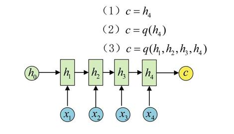
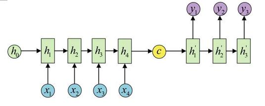
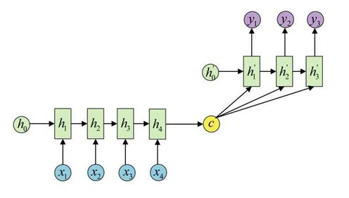
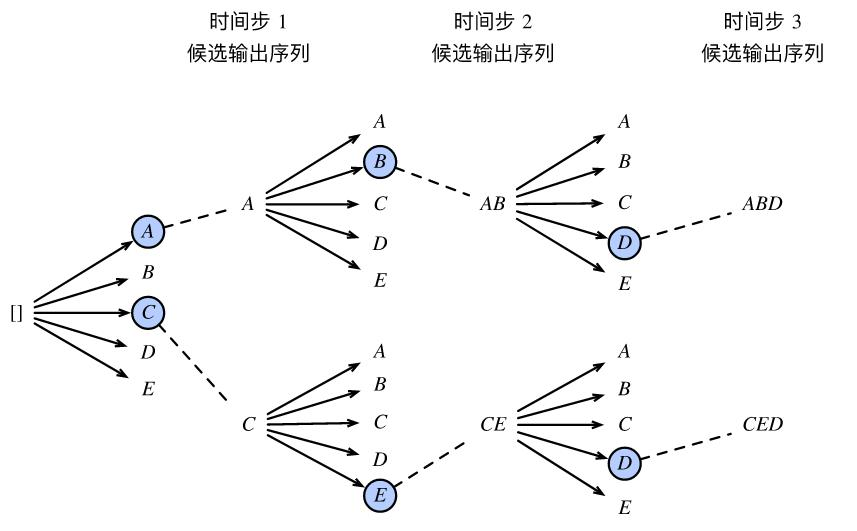
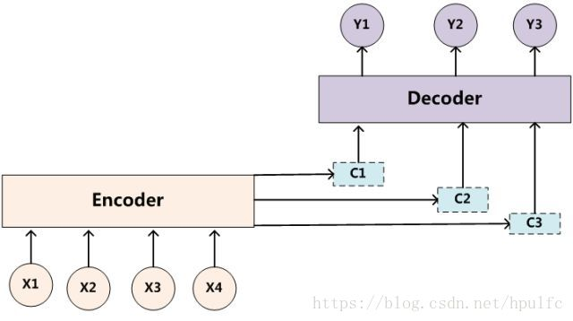

# seq2seq模型和Attention机制

## seq2seq

seq2seq模型是RNN最重要的一个变种：N对M（输入与输出序列长度不同）。  
seq2seq属于编码器-解码器（Encoder-Decoder）结构的一种，基本思想就是利用两个RNN，一个RNN作为Encoder，另一个RNN作为Decoder（注：这里所说的RNN，通常是LSTM或GRU）。  

Encoder编码器将一个不定长的输入序列变换成一个定长的背景向量c，如下图，得到向量c有多种方式，最简单的方法就是把Encoder的最后一个隐状态赋值给c，还可以对最后的隐状态做一个变换得到c，也可以对所有的隐状态做变换。  
   

得到c之后，就用另一个RNN网络对其进行解码，这部分RNN网络被称为Decoder。具体做法就是将c当做之前的初始状态h0输入到Decoder中：  
  
还有一种做法是将c当做每一步的输入：  
  

   
例子：  
假设我们做一个机器翻译的任务，那么有一句话可以拆成 $$x_1, ..., x_T$$ 个词的序列。编码器的下一个时刻的隐藏状态可以表示为 $$ h_t = f(x_t,h_{t-1})$$。$$f$$是循环网络隐藏层的变换函数，然后再定义一个函数$$q$$将每个时间步的隐藏状态变成背景向量$$c = q(h_1, ..., h_T)$$。而解码器就是根据背景信息输出序列$$y_1, y_2, ..., y_{T'}$$，我们可以使用另一个循环神经网络作为解码器，在输出序列的时间步$$t'$$，解码器将上一时间步的输出$$y_{t'-1}$$​以及背景变量$$c$$作为输入，并将它们与上一时间步的隐藏状态$$h'_{t'-1}$$​变换为当前时间步的隐藏状态$$h'_{t'}$$​。因此，我们可以用函数g表达解码器隐藏层的变换：$$ h'_{t'}=g(y_{t'-1}, c, h'_{t'-1})$$  最后再使用自定义的输出层和softmax运算来计算$$P(y_{t'} | y_1, ..., y_{t'-1}, c)$$。

**训练模型**  
根据最大似然估计，我们可以最大化输出序列基于输入序列的条件概率:  

$$ P(y_1, ..., y_{T'} | x_1, ..., x_T) = \prod_{t'=1}^{T'} P(y_{t'} | y_1, ..., y_{t'-1}, x_1, ..., x_T ) $$  

$$ = \prod_{t'=1}^{T'} P ( y_{t'} | y_1, ..., y_{t'-1}, c )$$  
损失函数:  

$$ -log P(y_1, ..., y_{T'} | x_1, ..., x_T) = \prod_{t'=1}^{T'} -log P ( y_{t'} | y_1, ..., y_{t'-1}, c )$$ 

**应用范围广泛**  
比如：  
机器翻译。Encoder-Decoder的最经典应用，事实上这一结构就是在机器翻译领域最先提出的。   
文本摘要。输入是一段文本序列，输出是这段文本序列的摘要序列。  
阅读理解。将输入的文章和问题分别编码，再对其进行解码得到问题的答案。  
语音识别。输入是语音信号序列，输出是文字序列。  

 
 

## 集束搜索(Beam Search)  

预测不定长序列的方法包括穷举搜索、贪婪搜索和束搜索。  
假设解码器的输出是一段文本序列,我们通常会在样本的输入序列和输出序列后面分别附上一个特殊符号 "&lt;eos&gt;" 表示序列的终止。 

**穷举搜索**  
设输出文本词典$$Y$$的大小为$$|Y|$$，输出序列的最大长度为$$T'$$。所有可能的输出序列一共有$$O(|Y|^{T'})$$种。我们要评估的序列数量就是全部的可能性。假设我们有10000个词，输出长度为10的序列，那么我们的可能性就是$$10000^{10}$$这么多种可能性。这几乎是不可能评估完的。  

**贪婪搜索（greedy search）**　　
对于输出序列任一时间步$$|t'|$$，我们从$$|Y|$$个词中搜索出条件概率最大的词$$y_{t'}= \mathop{argmax} \limits_{y_{t'} \in Y}  P(y_{t'} | y_1, ..., y_{t' - 1}, c)$$，每次只拿概率最高的那一个词，而遇到 "&lt;eos&gt;" 就停止检索。这是典型的贪婪算法，但是存在问题，就是检索空间太小，无法保证最优解。　　

**集束搜索(Beam Search)**　　
为了保证有更大的概率可以检索到较多的可能性，我们可以采用束搜索的方法，也就是说，我们每一次不再只看概率最高的那一个词，而是看概率最高的ｋ个词。ｋ代表**束宽（beam size）**。之后根据k个候选词输出下一个阶段的序列，接着再选出整个序列概率最高的k个，不断重复这件事情。最后我们会在各个状态的候选序列中筛选出包含特殊符号 "&lt;eos&gt;" 的序列，并将这个符号后的子序列舍弃，得到最后的输出序列。然后再在这些序列中选择分数最高的作为最后的输出序列： 
$$\frac{1}{L^\alpha} \log {P}(y_1, ..., y_L) = \frac{1}{L^\alpha} \displaystyle\sum_{t'=1}^L \log {P}(y_{t'} | y_1, ..., y_{t'-1}, c)$$  
其中$$L$$是最终序列的长度，$$\alpha$$一般选0.75,作用是惩罚太长的序列得分过高的情况。  
束搜索通过灵活的束宽来权衡计算开销和搜索质量，其计算开销为$$O(k|Y|T')$$。  
下图是束宽k为2的示例图:  
  

 
 

## Attention机制  
前面所提到的Encoder-Decoder是将整个序列都作为背景来学习。那比如说机器翻译里面，如果输入句子比较长，此时所有语义完全通过一个中间语义向量来表示，单词自身的信息已经消失，可想而知会丢失很多细节信息。  

实际上，人在翻译的时候，可能没必要将整个非常长的句子或段落全部看完并记住，翻译过程中只要先看一部分(以及附近词和上下文语境)，就可以将这部分先翻译出来，接着再继续往后看...  
借鉴于人的注意力机制，引入机器学习的注意力(Attention)机制。它在众多的输入信息中聚焦于对当前任务更为关键的信息，降低对其他信息的关注度，甚至过滤掉无关信息，就可以解决信息过载问题，并提高任务处理的效率和准确性。  

Attention 机制作为一种思想可以和多种模型进行结合，其本身不依赖于任何一种框架。  

带有 Attention 机制的 Encoder-Decoder 模型则是要从序列中学习到每一个元素的重要程度，然后按重要程度将元素合并。因此，注意力机制可以看作是 Encoder 和 Decoder 之间的接口，它向 Decoder 提供来自每个 Encoder 隐藏状态的信息。通过该设置，模型能够选择性地关注输入序列的有用部分，从而学习它们之间的“对齐”(即原文片段与其对应译文片段的匹配)。这就表明，在Encoder将输入的序列元素进行编码时，得到的不在是一个固定的语义编码C，而是存在多个语义编码，且不同的语义编码由不同的序列元素以不同的权重参数组合而成。一个简单地体现 Attention 机制运行的示意图如下：  
  

在 Attention 机制下，语义编码 C 就不在是输入序列 X 的直接编码了，而是各个元素按其重要程度加权求和得到的，即：  
$$ C_i = \displaystyle\sum_{j=0}^{T_x} a_{ij} f(x_j)$$  
其中，参数 $$i$$ 表示时刻， $$j$$ 表示序列中的第 $$j$$ 个元素， $$T_x$$ 表示序列的长度， $$f$$ 函数表示对元素 $$x_j$$ 的编码。$$a_{ij}$$ 可以看作是一个概率，反映了元素 $$h_j$$ 对 $$C_i$$ 的重要性，可以使用 softmax 来表示：  
$$a_{ij} = \frac {exp(e_{ij})} {\sum_{k=1}^{T_x}exp(e_{ik})}$$  
这里 $$e_{ij}$$ 正是反映了待编码的元素和其它元素之间的匹配度，当匹配度越高时，说明该元素对其的影响越大，则 $$a_{ij}$$ 的值也就越大。

