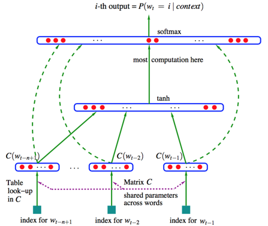

# 神经网络语言模型 (Neural Network Language Model)

神经网络语言模型（Neural Network Language Model，简称NNLM）,它采用一个简单的前向反馈神经网络来拟合一个词序列的条件概率$$p(w_t|w_1,w_2,...,w_{t-1})$$。  
整个模型的网络结构为一个三层神经网络。第一层为映射层，第二层为隐藏层，第三层为输出层. 见下图：

   

大致的操作是:从语料库中搜集一系列长度为n的文本序列 $$ w_{i-(n-1)},
..., w_{i-1}, w_i $$, 训练目标：在输入词序列为$$w_{i-(n-1)}, ..., w_{i-1}$$的情况下,计算目标词为$$w_i$$的概率。  

NNLM模型使用低维紧凑的词向量对上文进行表示,这解决了词袋模型带来的数据稀疏、语义鸿沟等问题,显然NNLM模型是一种更好的n元语言模型;另一方面,在相似的上下文语境中,NNLM模型可以预测出相似的目标词,而传统模型无法做到这一点。

但是，NNLM模型仍然存在一系列问题：  
1.一个问题是，由于NNLM模型使用的是全连接神经网络，因此只能处理定长的序列。  
2.另一个问题是，由于其巨大的参数空间，将NNLM的训练太慢了。即便是在百万量级的数据集上，即便是借助了40个CPU进行训练，NNLM也需要耗时数周才能给出一个稍微靠谱的解来。显然，对于现在动辄上千万甚至上亿的真实语料库，训练一个NNLM模型几乎是一个impossible mission。  

针对第一个问题，Mikolov等人在2010年提出了一种RNNLM模型，用递归神经网络代替原始模型里的前向反馈神经网络，从而解决了变长序列的问题。  
而NNLM模型的计算瓶颈主要是在第二步，是word2vec的提出才解决了该问题。  

