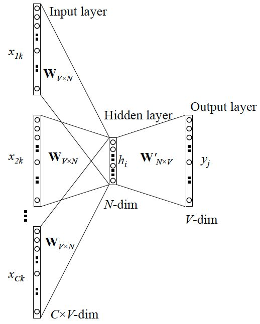

# word2vec的训练  

为了更高效地获取词向量,有研究者在NNLM和C&W模型的基础上保留其核心部分,得到了CBoW模型和Skip-gram模型。

## CBoW模型  
CBoW模型 (Continuous Bag of-Words)，也称连续词袋模型。它的目标是根据上下文来预测当前词语的概率,且上下文所有的词对当前词出现概率的影响的权重是一样的,因此叫continuous	bag-of-words模型。如在袋子中取词,取出数量足够的词就可以了,取出的先后顺序则是无关紧要的。  

简单概括其思路就是：输入中间词前后共C个词，预测中间词，在这个过程中训练出我们需要的词向量矩阵。其模型结构如下图所示：  

   
  
   
(待补充说明)    
   
   
用$$v$$表示背景词向量，用$$u$$表示中心词向量。  
设中心词$$w_c$$​在词典中索引为$$c$$，背景词$$w_{o_1}, ..., w_{o_{2m}}$$​在词典中索引为$$o_1,...,o_{2m}$$，因连续词袋模型的背景词有多个，我们取平均，那么给定背景词生成中心词的条件概率为:  
$$ P(w_c \vert w_{o_1}, ..., w_{o_{2m}}) = \frac { exp (u_c^T \frac{v_{o_1} + ... + v_{o_{2m}}}{2m} )  ) }  { \sum_{i} exp (u_i^T \frac{v_{o_1} + ... + v_{o_{2m}}}{2m} )  }  $$  

假设给定一个长度为$$T$$的文本序列，设时间步$$t$$的词为$$w^{(t)}$$。假设给定中心词的情况下背景词的生成相互独立，当背景窗口大小为$$m$$。  

连续词袋模型的最大似然估计等价于最小化损失函数:  
$$-\displaystyle\sum_{t=1}^T log P( w^{(t)} | w^{(t-m)}, ..., w^{(t-1)}, w^{(t+1)}, ..., w^{(t+m)} )$$

## Skip-gram模型  
Skip-gram模型也叫跳字模型。  
Skip-gram模型结构与CBoW模型大同小异，也包括输入层、投影层（其实是多余的，加上该层以便与与CBoW模型对比）和输出层，但它CBoW模型相反的是,CBow根据上下文来预测当前词该，而Skip-gram则是根据当前词语来预测上下文概率。  

    
  
   
(待补充说明)  
   

用$$v$$表示中心词向量，用$$u$$表示背景词向量。（注意符号的含义与BCoW模型中的相反。)    
设中心词$$w_c$$​在词典中索引为$$c$$，背景词$$w_o$$​在词典中索引为$$o$$，那么，给定中心词生成背景词的条件概率：  
$$ P(w_o \vert w_c) = \frac { exp(u_o^T v_c) } { \sum_{i} exp(u_i^T v_c) }  $$  

跳字模型的最大似然估计等价于最小化损失函数:  
$$ - \displaystyle\sum_{t=1}^T \displaystyle\sum_{-m \le j \le m , j \ne 0 } log P (w^{(t+j)} | w^{(t)}) $$

  
   
 
 
   

由于softmax运算考虑了背景词可能是词典VV中的任一词，以上损失包含了词典大小数目的项的累加。在上一节中我们看到，不论是跳字模型还是连续词袋模型，由于条件概率使用了softmax运算，每一步的梯度计算都包含词典大小数目的项的累加。对于含几十万或上百万词的较大词典，每次的梯度计算开销可能过大。为了降低该计算复杂度，本节将介绍两种近似训练方法，即负采样（negative sampling）或层序softmax（hierarchical softmax）。由于跳字模型和连续词袋模型类似，本节仅以跳字模型为例介绍这两种方法。

## 两个提速手段
不论是连续词袋模型还是跳字模型，由于条件概率使用了softmax运算，每一步的梯度计算都包含词典大小数目的项的累加。对于含几十万或上百万词的较大词典，每次的梯度计算开销可能过大。  
为了降低该计算复杂度，因此引入了两个提速手段：层次Softmax和负采样。普遍认为：层次Softmax对低频词效果较好；负采样对高频词效果较好，向量维度较低时效果更好。  

### 层次Softmax（Hierarchical Softmax）

层次Softmax(也叫分级Softmax)， 它将复杂的归一化概率问题转化为一系列二分类的条件概率相乘的形式。

一个词不是一下子就确定到底是属于10,000类中的哪一类，假如有一个分类器，它告诉你目标词是在词汇表的前5000个中还是在词汇表的后5000个词中，假如是在前5000，然后第二个分类器会告诉你这个词在词汇表的前2500个词中，或者在词汇表的第二组2500个词中，诸如此类，直到最终你找到一个词准确所在的分类器，那么就是这棵树的一个叶子节点。像这样有一个树形的分类器，意味着树上内部的每一个节点都可以是一个二分类器，比如逻辑回归分类器，所以你不需要再为单次分类，对词汇表中所有的10,000个词求和了。实际上用这样的分类树，计算成本与词汇表大小的对数成正比，而不是词汇表大小的线性函数，这个就叫做分级softmax分类器。  

在实践中常使用Huffman树(最优二叉树)，高频词离根结点更近，而低频词离根结点更远。

(待补充说明)

### 负采样 （Negative Sampling）

负采样（negative sampling），是为了加速words2vec的处理过程，主要解决的是给定一对单词，去预测这是否是上下文-目标词。  
  
例如:  
orange-juice是目标词，标记为1，称为正样本；  
orange-king不是目标词，标记为，称为负样本。  

负样本是在字典中随机选一个词。  

同样是采用监督学习的方法来实现，但是负样本的词选择数量减少，对于大样本集仅采集，每训练一个正样本仅使用2~5个负样本；对于小样本集也只使用5~20个负样本。

(待补充说明)  

## word2vec的局限性

word2vec通过嵌入一个线性的投影矩阵（projection matrix），将原始的one-hot向量映射为一个稠密的连续向量，并通过一个语言模型的任务去学习这个向量的权重，而这个过程可以看作是无监督或称为自监督的，其词向量的训练结果与语料库是紧密相关的，因此通常不同的应用场景需要用该场景下的语料库去训练词向量才能在下游任务中获得最好的效果。这一思想后来被广泛应用于包括word2vec在内的各种NLP模型中，从此之后不单单是词向量，我们也有了句向量、文档向量，从Word Embedding走向了World Embedding的新时代。word2vec非常经典，但也有其明显的局限性，其主要在以下几个方面：   
* 在模型训练的过程中仅仅考虑context中的局部语料，没有考虑到全局信息； 
* 对于英文语料，对于什么是词，怎样分词并不是问题（但个词就是独立的个体）。而对于中文而言，我们在训练词向量之前首先要解决分词的问题，而分词的效果在很多情况下将会严重影响词向量的质量（如分词粒度等），因此，从某些方面来说word2vec对中文不是那么的友好；  
* 在2018年以前，对于word2vec及其一系列其他的词向量模型都有一个相同的特点：其embedding矩阵在训练完成后便已经是固定了的，这样我们可以轻易从网上获取到大量预训练好的词向量并快速应用到我们自己任务中。但从另一个角度来说，对于同一个词，在任意一个句子，任意一个环境下的词向量都是固定的，这对于一些歧义词来说是存在较大问题的，这也是限制类似word2vec、Glove等词向量工具性能的一个很重要的问题。