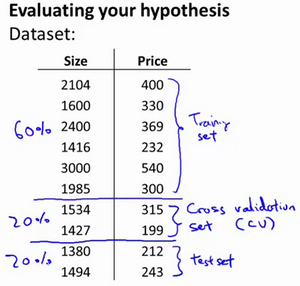

# 数据集划分

## 训练集测试集 比例7:3  
###【评估一个假设】  

为了检验算法是否过拟合，我们将数据分成训练集和测试集，通常用70%的数据作为训练集，用剩下30%的数据作为测试集。很重要的一点是训练集和测试集均要含有各种类型的数据。

测试集评估在通过训练集让我们的模型学习得出其参数 $$\theta$$ 后，对测试集运用该模型，我们有两种方式计算误差：  

1.对于线性回归模型，我们利用测试集数据计算代价函数  
$$ J_{test}(\theta) = \frac{1}{2m_{test}} \displaystyle\sum_{i=1}^{m_{test}} (h_\theta(x^{(i)}_{test}) - y^{(i)}_{test})^2 $$

 

2.对于逻辑回归模型，我们可以利用测试数据集来计算代价函数外：  
$$ J_{test}(\theta) = -\frac{1}{m_{test}}\displaystyle\sum_{i=1}^{m_{test}} \log{h_\theta(x^{(i)}_{test})} + (1-{y^{(i)}_{test}}) \log{h_\theta(x^{(i)}_{test})} $$  
还可以用另一种测试度量方法叫错误分类法，也称0/1分类错误：  
$$ err(h_\theta(x,y)) = \begin{cases}  1 \ \ \ \ \ \   if\  h_\theta(x) \ge 0.5\ and\ y = 0  \ \ \ \ or  \ \ \ \ if \ h_\theta(x) \lt 0.5\ and\ y = 1  \\   0 \ \ \ \ \ \   Otherwise    \end{cases} $$  
然后对计算结果求平均: $$ error = -\frac{1}{m_{test}} \displaystyle\sum_{i=1}^{m_{test}} err(h_\theta(x^{(i)}_{test}), y^{(i)}_{test}) $$

##  训练集交叉验证集测试集 比例6:2:2  
### 【模型选择和交叉验证集】  
假设我们要在10个不同次数的二项式模型之间进行选择：  
1.$$ h_\theta(x) = \theta_0 + \theta_1 x $$  
2.$$ h_\theta(x) = \theta_0 + \theta_1 x + \theta_2 x^2 $$  
3.$$ h_\theta(x) = \theta_0 + \theta_1 x + ... + \theta_3 x^3 $$  
...  
10.$$ h_\theta(x) = \theta_0 + \theta_1 x + ... + \theta_{10} x^{10} $$  

显然越高次数的多项式模型越能够适应我们的训练数据集，但是适应训练数据集并不代表着能推广至一般情况，我们应该选择一个更能适应一般情况的模型。我们需要使用交叉验证集来帮助选择模型。  
即：使用60%的数据作为训练集，使用 20%的数据作为交叉验证集，使用20%的数据作为测试集。  
  
  
模型选择的方法为：  
1.使用训练集分别训练出10个模型   
Training error:  
 $$ J_{train}(\theta) = \frac{1}{2m}\displaystyle\sum_{i=1}^{m}(h_{\theta}(x^{(i)})-y^{(i)})^2 $$  
2.用10个模型分别对交叉验证集计算得出交叉验证误差（代价函数的值）  
 Cross Validation error:  
 $$J_{cv}(\theta) = \frac{1}{2m_{cv}}\displaystyle\sum_{i=1}^{m}(h_{\theta}(x^{(i)}_{cv})-y^{(i)}_{cv})^2$$   

3.选取代价函数值最小的模型  
4用步骤3中选出的模型对测试集计算得出推广误差（代价函数的值）  
 Test error:  
 $$J_{test}(\theta)=\frac{1}{2m_{test}}\displaystyle\sum_{i=1}^{m_{test}}(h_{\theta}(x^{(i)}_{cv})-y^{(i)}_{cv})^2$$  

##  大数据情况   验证集和测试集占量的比例不必很大

当我们的数据量是百万级别时，那么验证集和测试集占数据总量的比例会趋向于变得更小。

验证集的目的就是验证不同的算法，检验哪种算法更有效，验证集要足够大才能评估，比如2个甚至10个不同算法，并迅速判断出哪种算法更有效，但是对于数据集很大的情况，我们可能不需要拿出20%的数据作为验证集。比如我们有100万条数据，那么取1万条数据便足以进行评估，找出其中表现最好的1-2种算法。  

同样地，根据最终选择的分类器，测试集的主要目的是正确评估分类器的性能，所以，如果拥有百万数据，我们只需要1000条数据，便足以评估单个分类器，并且准确评估该分类器的性能。

假设我们有100万条数据，其中1万条作为验证集，1万条作为测试集，100万里取1万，比例是1%，即：训练集占98%，验证集和测试集各占1%。对于数据量过百万的应用，训练集可以占到99.5%，验证和测试集各占0.25%，或者验证集占0.4%，测试集占0.1%。
