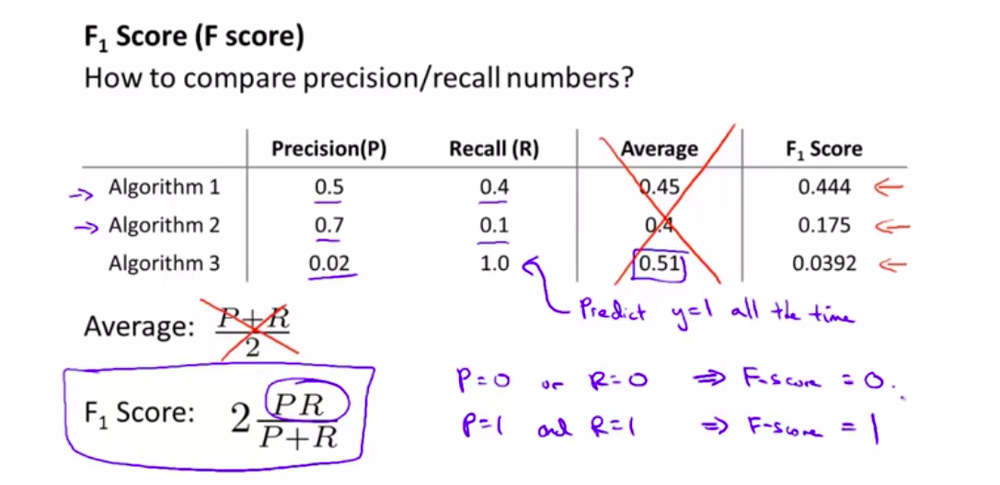

# 误差分析（Error Analysis）  

误差分析要做的既是检验交叉验证集中我们的算法产生错误预测。
误差分析并不总能帮助我们判断应该采取怎样的行动。有时我们需要尝试不同的模型，然后进行比较，在模型比较时，用数值来判断哪一个模型更好更有效，通常我们是看交叉验证集的误差。

​

构建一个学习算法的推荐方法为：  
1.从一个简单的能快速实现的算法开始，实现该算法并用交叉验证集数据测试这个算法。  
2.绘制学习曲线，决定是增加更多数据，或者添加更多特征，还是其他选择​。  
3.进行误差分析：人工检查交叉验证集中我们算法中产生预测误差的样本，看看这些样本是否有某种系统化的趋势，然后来决定优化算法的方式。  
假设你有了一个快速而不完美的算法实现，又有一个数值的评估数据，这会帮助你尝试新的想法，快速地发现你尝试的这些想法是否能够提高算法的表现，从而你会更快地做出决定，在算法中放弃什么，吸收什么误差分析可以帮助我们系统化地选择该做什么。  

##偏斜类的误差度量  
类偏斜情况表现为我们的训练集中有非常多的同一种类的样本，只有很少或没有其他类的样本。  
例如我们希望用算法来预测癌症是否是恶性的，在我们的训练集中，只有0.5%的实例是恶性肿瘤。假设我们编写一个非学习而来的算法，在所有情况下都预测肿瘤是良性的，那么误差只有0.5%。然而我们通过训练而得到的神经网络算法却有1%的误差。这时，误差的大小是不能视为评判算法效果的依据的。  

### **查准率**（**Precision**）和**查全率**（**Recall**） 

我们将算法预测的结果分成四种情况：  
​1.**正确肯定**（**True Positive,TP**）：真正(真阳)。预测为真，实际为真。  
2.**正确否定**（**True Negative,TN**）：真负(正阴)。预测为假，实际为假。  
3.**错误肯定**（**False Positive,FP**）：假正(假阳)。预测为真，实际为假。  
4.**错误否定**（**False Negative,FN**）：假负(假阴)预测为假，实际为真。  

则：  
查准率=**TP/(TP+FP)**。例，在所有我们预测有恶性肿瘤的病人中，实际上有恶性肿瘤的病人的百分比，越高越好。  
查全率=**TP/(TP+FN)**。例，在所有实际上有恶性肿瘤的病人中，成功预测有恶性肿瘤的病人的百分比，越高越好。  
这样，对于我们刚才那个总是预测病人肿瘤为良性的算法，其查全率是0。  

**查准率和查全率的权衡**  
假设，我们的算法输出的结果在0-1 之间，我们使用阀值0.5 来预测真和假。   
如果我们希望只在非常确信的情况下预测为真（肿瘤为恶性），即我们希望更高的查准率，我们可以使用比0.5更大的阀值，如0.7，0.9。这样做我们会减少错误预测病人为恶性肿瘤的情况，同时却会增加未能成功预测肿瘤为恶性的情况。  
如果我们希望提高查全率，尽可能地让所有有可能是恶性肿瘤的病人都得到进一步地检查、诊断，我们可以使用比0.5更小的阀值，如0.3。  
我们可以将不同阀值情况下，查准率与查全率的关系绘制成图表，曲线的形状根据数据的不同而不同：  
  

如果我们希望有一个帮助我们选择这个阀值的方法。一种方法是计算**F1 值**（**F1 Score**）
假设我们有3个不同的学习算法，或者是相同的算法但临界值不同，得到3种算法的查准率和查全率各不相同，如下图，如何判断那种算法比较好？对于查准率P和查全率R，不能简单的求平均值来评估。我们采用一种结合查准率和查全率的方法，叫F值，也叫F1值，公式是：$$ F_1 Score : 2 \frac{PR}{P+R} $$  

  

​