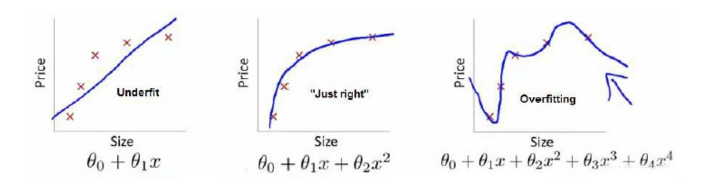
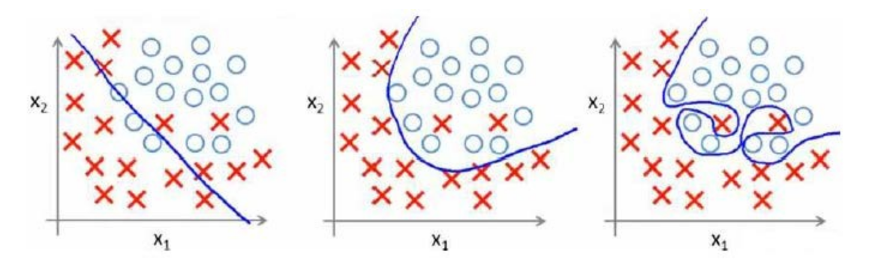

# 拟合问题

### 欠逆合与过拟合   
下图是一个回归问题的例子：  
  
第一个模型是一个线性模型，欠拟合，不能很好地适应我们的训练集；  
第三个模型是一个四次方的模型，过于强调拟合原始数据，而丢失了算法的本质：预测新数据。  
我们可以看出，若给出一个新的值使之预测，它将表现的很差，是过拟合，虽然能非常好地适应我们的训练集但在新输入变量进行预测时可能会效果不好；而中间的模型似乎最合适。  
分类问题中也存在这样的问题：  
  

就以多项式理解，x的次数越高，拟合的越好，但相应的预测的能力就可能变差。
问题是，如果我们发现了过拟合问题，应该如何处理？  
1.丢弃一些不能帮助我们正确预测的特征。可以是手工选择保留哪些特征，或者使用一些模型选择的算法来帮忙（例如PCA）。  
2.正则化。 保留所有的特征，但是减少参数的大小（magnitude）。 