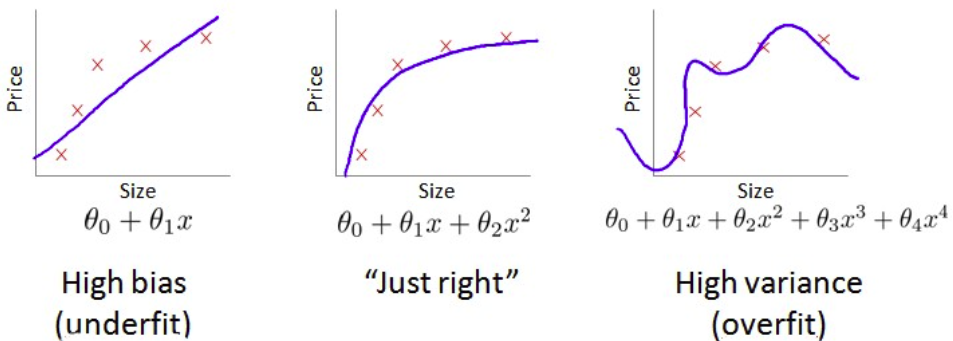
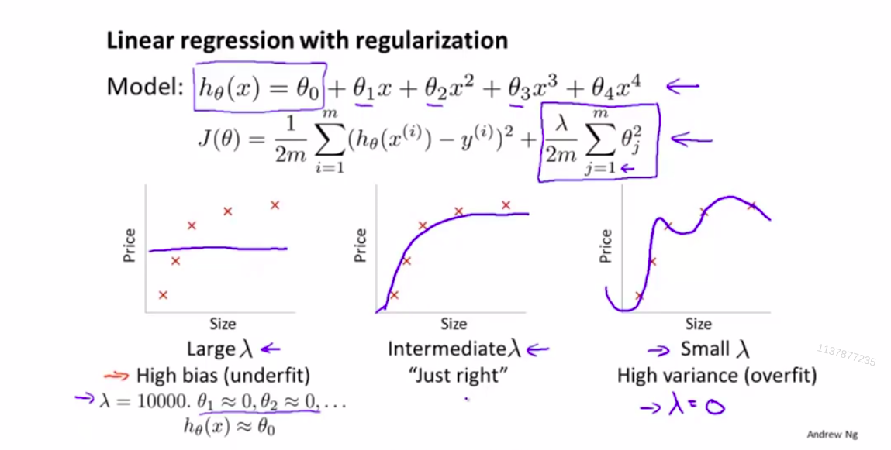
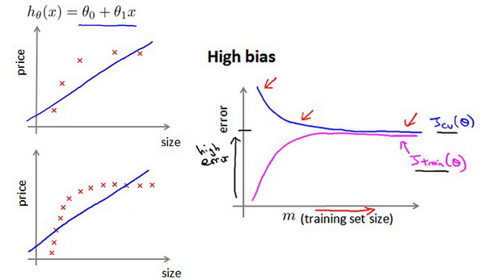
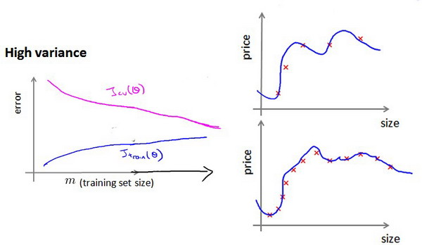

# 诊断

## 诊断偏差和方差
当你运行一个学习算法时，如果这个算法的表现不理想，那么多半是出现两种情况：要么是偏差比较大，要么是方差比较大。换句话说，出现的情况要么是欠拟合，要么是过拟合问题。  
  
将训练集和交叉验证集的代价函数误差与多项式的次数绘制在同一张图表上来帮助分析：  
  
  
其中，d是多项式的次数。  
对于训练集，当d较小时，模型拟合程度更低，误差较大；随着d的增长，拟合程度提高，误差减小。  
对于交叉验证集，当d较小时，模型拟合程度低，误差较大；但是随着d的增长，误差呈现先减小后增大的趋势，转折点是我们的模型开始过拟合训练数据集的时候。  
   
训练集误差和交叉验证集误差近似时：偏差/欠拟合  
交叉验证集误差远大于训练集误差时：方差/过拟合  

## 正则化和偏差/方差  
在我们在训练模型的过程中，一般会使用一些正则化方法来防止过拟合。但是我们可能会正则化的程度太高或太小了，即我们在选择λ的值时也需要思考与刚才选择多项式模型次数类似的问题。  
   我们选择一系列的想要测试的 $$\lambda$$ 值，例如 0-10之间的呈现2倍关系的值（如：$0,0.01,0.02,0.04,0.08,0.15,0.32,0.64,1.28,2.56,5.12,10$共12个）。 我们同样把数据分为训练集、交叉验证集和测试集。  
   
选择$$\lambda$$的方法为：  
1.使用训练集训练出12个不同程度正则化的模型  
2.用12个模型分别对交叉验证集计算的出交叉验证误差  
3.选择得出交叉验证误差最小的模型  
4.运用步骤3中选出模型对测试集计算得出推广误差，我们也可以同时将训练集和交叉验证集模型的代价函数误差与$$\lambda$$的值绘制在一张图表上：  
  
当 $$\lambda$$ 较小时，训练集误差较小（过拟合）而交叉验证集误差较大​。  
随着 $$\lambda$$ 的增加，训练集误差不断增加（欠拟合），而交叉验证集误差则是先减小后增加。  

## 学习曲线  
学习曲线是将训练集误差和交叉验证集误差作为训练集样本数量（$$m$$）的函数绘制的图表，可用来判断某一个学习算法是否处于偏差、方差问题。  
训练出来的模型却不能很好地适应交叉验证集数据或测试集数据。  
  

**高偏差/欠拟合的学习曲线**   
作为例子，我们尝试用一条直线来适应下面的数据，可以看出，无论训练集有多么大误差都不会有太大改观：  
  
也就是说在高偏差/欠拟合的情况下，增加数据到训练集不一定能有帮助。  

**高方差/过拟合的学习曲线**  
假设我们使用一个非常高次的多项式模型，并且正则化非常小，可以看出，当交叉验证集误差远大于训练集误差时，往训练集增加更多数据可以提高模型的效果。  
  
也就是说在高方差/过拟合的情况下，增加更多数据到训练集可能可以提高算法效果。  

