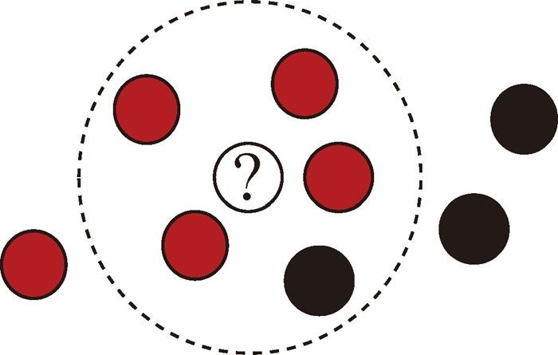
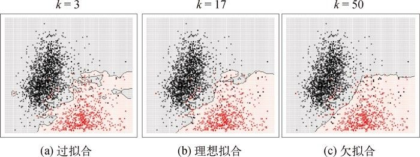

# K-近邻算法

K近邻法(k-nearest neighbors），简称KNN。  
原理：“物以类聚，人以群分”。相同/近似样本在样本空间中是比较接近的，所以可以使用和当前样本比较近的其他样本的目标属性值作为当前样本的预测值。  
在给定测试样本，基于某种距离度量（一般使用欧几里德距离）找出训练集中与其最靠近的k个训练样本，然后基于这k个“邻居”的信息来进行预测。

以k=5为例，在下图中的问号所指的点，离它最近的5个点中，有红点有4个，而黑点只有1个,那么它很可能就是红色的。  
  

 

选择k值的过程叫作参数调优,它对预测的准确度起着至关重要的作用。  
如果k值太小,数据点只与最近的“邻居”匹配,并且随机噪声所产生的误差也会被放大,如下图(a)所示。如果k值太大,数据点会尝试与更远的“邻居”匹配,其中隐含的模式会被忽略,如下图(c)所示。只有当k值恰到好处时,数据点才会参考合适数量的“邻居”,这使得误差相互抵消,有利于揭示数据中隐藏的趋势,如下图(b)所示。  

   

 

为实现理想拟合并把误差降到最低,可以使用交叉验证法对参数k进行调优。  

 

对于二分类问题,可以把k设置成一个奇数,以避免出现平局的情况。  

 

KNN算法不仅可以用于分类，还可以用于回归。  
通过找出一个样本的k个最近邻居，计算这些邻居的某个（些）属性的平均值，或加权平均值(越近的“邻居”权重越大)，从而预测该样本对应属性的值。

