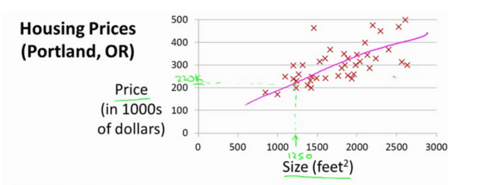
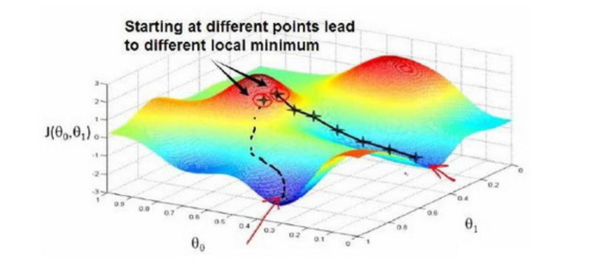
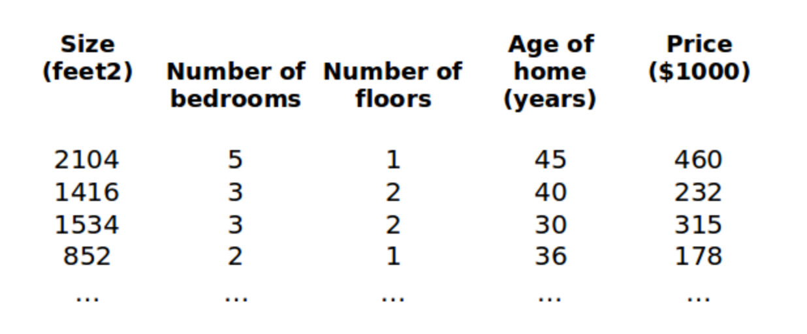

# 线性回归 (Linear Regression)

## 单变量线性回归

简单的房价预测例子  

我们将要用来描述这个回归问题的标记如下:  

$$ m $$ 代表训练集中实例的数量  
$$ x $$ 代表特征/输入变量  
$$ y $$ 代表目标变量/输出变量  
$$ (x, y) $$ 代表训练集中的实例  
$$ (x^{(i)}, y^{(i)}) $$ 代表第 $$ i $$ 个观察实例  

假设表达函数是这种单变量的线性方式：  
$$ h_\theta(x) = \theta_0 + \theta_1 x $$

** 代价函数：**  
$$ J(\theta_0, \theta_1) = \frac{1}{2m} \displaystyle{\sum_{i=1}^{m}} (h_\theta(x^{(i)}) - y^{(i)})^2 $$

目标是：求$$ \theta_0 , \theta_1 $$ 的值，使得 $$ J(\theta_0, \theta_1) $$

** 梯度下降 **  

梯度下降过程中，不断迭代更新$$ \theta_0 , \theta_1 $$ 的值：  
$$ temp0 = \theta_0 - \alpha \frac{\partial}{\partial \theta_0} J(\theta_0, \theta_1) = ... = \theta_0 - \alpha \frac{1}{m} \displaystyle{\sum_{i=1}^{m}} (h_\theta(x^{(i)}) - y^{(i)}) $$  
$$ temp1 = \theta_1 - \alpha \frac{\partial}{\partial \theta_1} J(\theta_0, \theta_1) = ... = \theta_1 - \alpha \frac{1}{m} \displaystyle{\sum_{i=1}^{m}} ((h_\theta(x^{(i)}) - y^{(i)}) \cdot x^{(i)}) $$    
$$ \theta_0 = temp0 $$  
$$ \theta_1 = temp1 $$  

其中 $$ \alpha $$ 是学习率（learning rate），它决定了我们沿着能让代价函数下降程度最大的方向向下迈出的步子有多大。
如果学习率过小，则达到收敛所需的迭代次数会非常高；如果学习率过大，每次迭代可能不会减小代价函数，可能会越过局部最小值导致无法收敛。  
通常可以考虑尝试些学习率：0.01, 0.03, 0.1, 0.3, 1, 3, 10

## 多变量线性回归  

对房价模型增加更多的特征，例如房间数楼层等，构成一个含有多个变量的模型，模型中的特征为 $$ (x_1,x_2,...,x_n) $$  

  

支持多变量的假设函数表示为：$$ h_\theta(x) = \theta_0 + \theta_1 x_1 + \theta_2 x_2 + ... + \theta_n x_n $$
引入 $$ x_0 = 1 $$,则函数转化为：  
$$ h_\theta(x) = \theta_0 x_0 + \theta_1 x_1 + \theta_2 x_2 + ... + \theta_n x_n $$  即  
$$ h_\theta(x) = {\theta}^{T} X $$  

** 代价函数：**  
$$ J(\theta_0, \theta_1, ..., \theta_n) = \frac{1}{2m} \displaystyle{\sum_{i=1}^{m}} (h_\theta(x^{(i)}) - y^{(i)})^2 $$

下降算法：  
$$ \theta_j := \theta_j - \alpha \frac{\partial}{\partial \theta_j} J(\theta_0, \theta_1, ..., \theta_n) = ... = \theta_j - \alpha \frac{1}{m} \displaystyle{\sum_{i=1}^{m}} ((h_\theta(x^{(i)}) - y^{(i)}) \cdot {x_j}^{(i)}) $$    

当 n > 1 时：  
$$ \theta_0 := \theta_0 - \alpha \frac{1}{m} \displaystyle{\sum_{i=1}^{m}} ((h_\theta(x^{(i)}) - y^{(i)}) \cdot {x_0}^{(i)}) $$  
$$ \theta_1 := \theta_1 - \alpha \frac{1}{m} \displaystyle{\sum_{i=1}^{m}} ((h_\theta(x^{(i)}) - y^{(i)}) \cdot {x_1}^{(i)}) $$  
$$ \theta_2 := \theta_2 - \alpha \frac{1}{m} \displaystyle{\sum_{i=1}^{m}} ((h_\theta(x^{(i)}) - y^{(i)}) \cdot {x_2}^{(i)}) $$  
...  

** 特征收缩 **  
在我们面对多维特征问题的时候，我们要保证这些特征都具有相近的尺度，这将帮助梯度下降算法更快地收敛，解决的方法是尝试将所有特征的尺度都尽量缩放到-1到1之间。  

最简单的方法是令：$$ x_n = \frac{x_n - \mu_n}{s_n} $$，其中 $$ \mu_n $$ 是平均值，$$ s_n $$ 是标准差。  

** 多项式回归 **  
线性回归并不适用于所有数据，有时我们需要曲线来适应我们的数据，比如一个二次方模型：$$ h_\theta(x) = \theta_0 + \theta_1 x_1 + \theta_2 {x_2}^2 $$  或者三次方模型：$$ h_\theta(x) = \theta_0 + \theta_1 x_1 + \theta_2 {x_2}^2 + \theta_3 {x_3}^3 $$
通常我们需要先观察数据然后再决定准备尝试怎样的模型。另外，我们可以令：$$ x_2 = {x_2}^2, x_3 = {x_3}^3 $$ ，从而将模型转化为线性回归模型。

## 正规方程  
正规方程是通过求解下面的方程来找出使得代价函数最小的参数的：$$ \alpha \frac{\partial}{\partial \theta_j} J(\theta_j) = 0 $$。 假设我们的训练集特征矩阵为 $$ X $$ (包含了 $$ x_0=1$$ )，并且我们的训练集结果为向量$$ y $$ ，则利用正规方程解出向量:  
$$ \theta = (X^T X)^{-1} X^T y $$   
注：对于那些不可逆的矩阵（通常是因为特征之间不独立，如同时包含英尺为单位的尺寸和米为单位的尺寸两个特征，也有可能是特征数量大于训练集的数量），正规方程方法是不能用的。  

** 梯度下降与正规方程的比较：**  

| 梯度下降 | 正规方程 |
| :------------- | :------------- |
| 需要选择学习率 $$ \alpha $$ | 不需要 |
| 需要多次迭代 | 一次运算得出 |
| 当特征数量 $$n$$ 大时也能较好适用 | 需要计算 $$ (X^T X)^{-1} $$ 如果特征数量 $$n$$ 较大则运算代价大，因为矩阵逆的计算时间复杂度为 $$ O(n^3)$$，通常来说当 $$n$$ 小于10000 时还是可以接受的 |
| 适用于各种类型的模型 | 只适用于线性模型，不适合逻辑回归模型等其他模型 |
