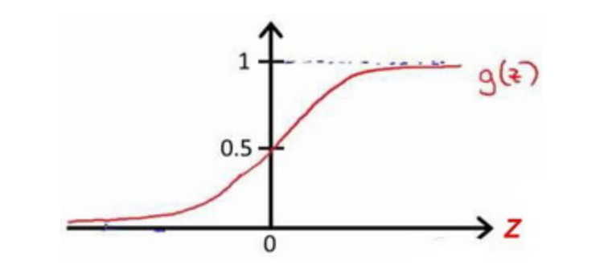
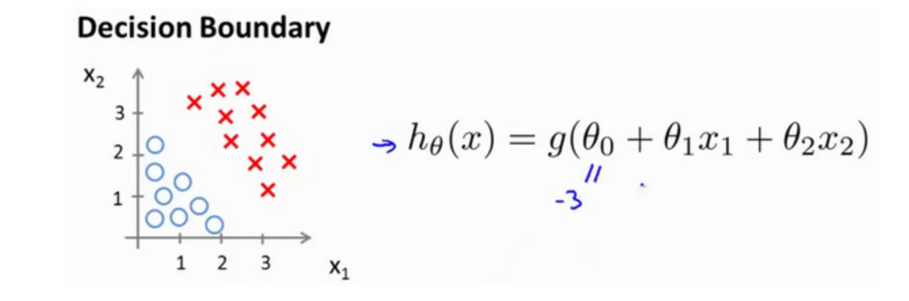
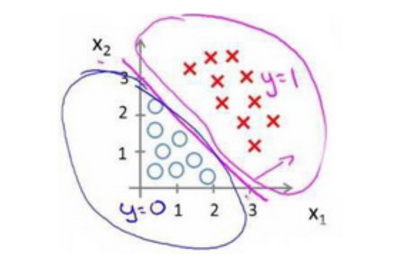
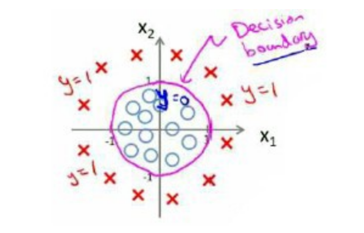
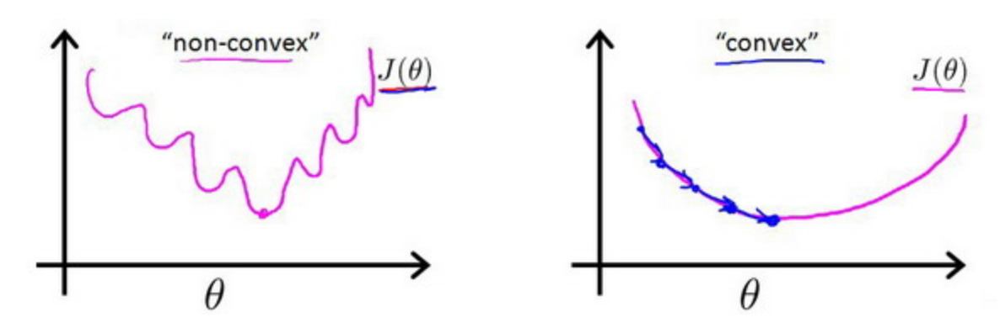
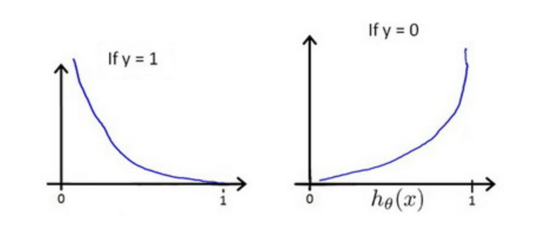
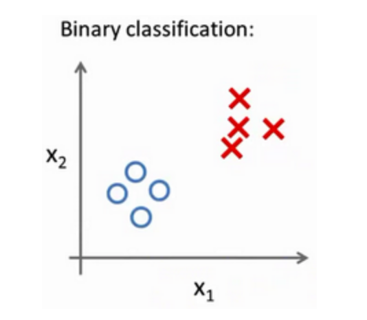
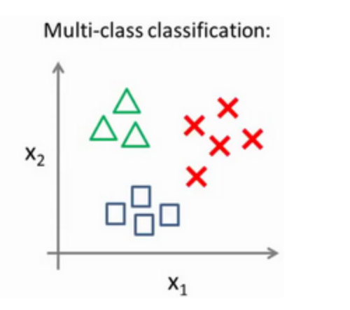
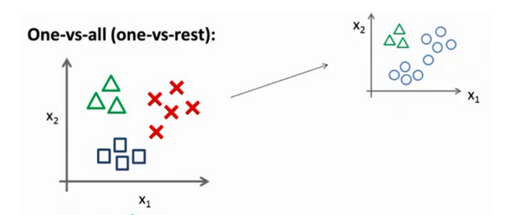

# 逻辑回归 (Logistic Regression)

逻辑回归虽然名称出现了“回归”，但实际上是一种分类算法，它适用于预测变量取值是离散的情况。当我们尝试预测的是结果是否属于某一个类（例如正确或错误），即二元分类，使用逻辑回归的算法，这是目前最流行使用最广泛的一种学习算法。

我们引入一个新的模型，逻辑回归，该模型的输出变量范围始终在0和1之间。 逻辑回归模型的假设是：  
$$ h_\theta(x) = g({\theta}^T X) $$  
其中：$$ X $$ 代表特征向量，$$ g $$ 代表逻辑函数（logistic function)，是一个常用的逻辑函数为S形函数 **（Sigmoid function）**，公式为：  
$$ g(z)=\frac{1}{1+e^{-z}} $$

$$ h_\theta(x) $$ 的作用是，对于给定的输入变量，根据选择的参数计算输出变量等于1的可能性（estimated probablity）即$$ h_\theta(x)=P(y=1|x;\theta) $$   例如，如果对于给定的$$ x $$，通过已经确定的参数计算得出$$ h_\theta(x)=0.7 $$ ，则表示有70%的几率$$ y $$为正向类，相应地$$ y $$为负向类的几率为1-0.7=0.3。

### 决策边界(decision boundary)   
在逻辑回归中，我们预测：  
当 $$ h_\theta(x) \ge 0.5 $$ 时，预测$$y=1$$  
当 $$ h_\theta(x) < 0.5 $$ 时，预测$$y=0$$  
根据上面绘制出的 S 形函数图像，我们知道当  
$$ z=0 $$ 时 $$ g(z)=0.5 $$  
$$ z>0 $$ 时 $$ g(z)>0.5 $$  
$$ z<0 $$ 时 $$ g(z)<0.5 $$  
又 $$ z={\theta}^T x $$，即:  
$$ {\theta}^T x \ge 0 $$ 时，预测 $$ y=1$$  
$$ {\theta}^T x < 0 $$ 时，预测 $$ y=0$$  

现在假设我们有一个模型：  
  
并且参数$$ \theta $$ 是向量 [-3 1 1]。 则当$$ -3 + x_1 + x_2 \ge 0$$ 即时，即 $$ x_1 + x_2 \ge 3 $$ 时，  模型将预测 $$ y = 1 $$ 。 我们可以绘制直线 $$ x_1 + x_2 = 3 $$，这条线便是我们模型的分界线，将预测为1的区域和预测为 0的区域分隔开。  
  
假使我们的数据呈现这样的分布情况，怎样的模型才能适合呢？  
  
因为需要用曲线才能分隔 $$ y = 0 $$ 的区域和 $$ y = 1 $$ 的区域，我们需要二次方特征：  
$$ h_{\theta}(x) = g(\theta_0 + \theta_1 x_1 + \theta_2 x_2 + \theta_3 {x_1}^2 + \theta_4 {x_2}^2) $$ 是[-1 0 0 1 1]，则我们得到的判定边界恰好是圆点在原点且半径为1的圆形。  
我们可以用非常复杂的模型来适应非常复杂形状的判定边界。

### 代价函数  
对于线性回归模型，我们定义的代价函数是所有模型误差的平方和。理论上来说，我们也可以对逻辑回归模型沿用这个定义，但是问题在于，当我们将$$ h_\theta(x)=\frac{1}{1+e^{-{\theta}^T x}} $$带入到这样定义了的代价函数中时，我们得到的代价函数将是一个非凸函数（non-convexfunction）。  
  
这意味着我们的代价函数有许多局部最小值，这将影响梯度下降算法寻找全局最小值。  
我们重新定义逻辑回归的代价函数为：  
$$ J(\theta) = \frac{1}{m} \displaystyle\sum_{i=1}^{m} Cost(h_\theta(x^{(i)}), y^{(i)}) $$  
其中，
$$ Cost(h_\theta(x),y) = \begin{cases}   -\log(h_\theta(x))  &\text{if} \ y=1 \\   -\log(1 - h_\theta(x))  &\text{if} \ y=0    \end{cases} $$  

$$ h_\theta(x) $$ 与 $$ Cost(h_\theta(x), y) $$ 之间的关系如下图所示：  
  
这样构建的 $$ Cost(h_\theta(x),y) $$ 函数的特点是：  
当实际的 $$ y=1 $$ 且 $$ h_\theta(x) $$ 也为1时误差为 0，当 $$ y=1 $$ 但 $$ h_\theta(x) $$ 不为1时误差随着$$ h_\theta(x) $$ 变小而变大；  
当实际的 $$ y=0 $$ 且 $$ h_\theta(x) $$ 也为0时代价为 0，当 $$ y=0 $$ 但 $$ h_\theta(x) $$ 不为0时误差随着$$ h_\theta(x) $$ 变大而变大。  
简化：  
$$ Cost(h_\theta(x),y) = -y \times \log (h_\theta(x)) - (1-y) \times \log (1-h_\theta(x)) $$  
代入代价函数：  
$$ J(\theta) = \frac{1}{m} \displaystyle\sum_{i=1}^{m} [ -y^{(i)} \times \log (h_\theta(x^{(i)})) - (1-y^{(i)}) \times \log (1-h_\theta(x^{(i)})) ] $$  即：  
$$ J(\theta) = -\frac{1}{m} \displaystyle\sum_{i=1}^{m} [ y^{(i)} \times \log (h_\theta(x^{(i)})) + (1-y^{(i)}) \times \log (1-h_\theta(x^{(i)})) ] $$    
利用梯度下降算法来求能使代价函数最小参数：  
$$ \theta_j := \theta_j - \alpha \frac{\partial}{\partial \theta_j} J(\theta) = ... = \theta_j - \alpha \frac{1}{m} \displaystyle\sum_{i=1}^{m} ((h_\theta(x^{(i)}) - y^{(i)}) {x_j}^{(i)}) $$     (推到过程略)  
注：虽然得到的梯度下降算法表面上看上去与线性回归的梯度下降算法一样，但是这里的$$ h_\theta(x) = g({\theta}^T X) $$ 与线性回归中不同，所以实际上是不一样的。另外，在运行梯度下降算法之前，进行特征缩放依旧是非常必要的。   
除了梯度下降算法以外，还有一些常被用来令代价函数最小的算法，这些算法更加复杂和优越，而且通常不需要人工选择学习率，通常比梯度下降算法要更加快速。这些算法有：共轭梯度（Conjugate Gradient），局部优化法(Broyden fletcher goldfarb shann,BFGS)和有限内存局部优化法(LBFGS) 等，相对复杂。常见的机器学习库都有提供相应的函数方法。

### 逻辑回归应用在多类分类  
对于之前的二元分类问题，我们的数据看起来可能是像这样：  
  
对于一个多类分类问题，我们的数据集或许看起来像这样：  
  
逻辑回归可以将数据集一分为二为正类和负类，利用一对多（或一对余）的分类思想，我们可以将其用在多类分类问题上。  
  
我们将多个类中的一个类标记为正向类（$$ y=1 $$），然后将其他所有类都标记为负向类，这个模型记作 $$ {h_\theta}^(1) $$。接着，类似地第我们选择另一个类标记为正向类（$$ y=2 $$），再将其它类都标记为负向类，将这个模型记作$$ {h_\theta}^(2) $$ ,依此类推。 最后我们得到一系列的模型简记为：$$ {h_\theta}^(i) = p(y=i|x;\theta) $$ 其中：$$ i=(1,2,3....k) $$  
最后，在我们需要做预测时，我们将所有的分类机都运行一遍，然后对每一个输入变量，都选择最高可能性的输出变量。  
