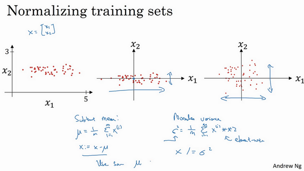

# 归一化输入(Normalizing inputs)  
训练神经网络，其中一个加速训练的方法就是归一化输入。  
假设一个训练集有两个特征，输入特征为2维，归一化需要两个步骤：  
第一步是零均值化，$$\mu = \frac{1}{m}\displaystyle\sum_{i =1}^{m}x^{(i)}$$，它是一个向量，$$x$$等于每个训练数据 $$x$$减去$$\mu$$，意思是移动训练集，直到它完成零均值化。  
第二步是归一化方差，注意特征$$x_{1}$$的方差比特征$$x_{2}$$的方差要大得多，我们要做的是给$$\sigma$$赋值，$$\sigma^{2}= \frac{1}{m}\displaystyle\sum_{i =1}^{m}{({x^{(i)})}^{2}}$$，这是节点$$y$$ 的平方，$$\sigma^{2}$$是一个向量，它的每个特征都有方差，注意，我们已经完成零值均化，$$({x^{(i)})}^{2}$$元素$$y^{2}$$就是方差，我们把所有数据除以向量$$\sigma^{2}$$，最后变成下图形式。  
  

**归一化输入特征的意义：**  
归一化特征，使代价函数平均起来看更对称。
假如输入特征$$x$$为2维，$$x_1$$取值范围从1到1000，$$x_2$$取值范围从0到1，未归一化输入的话，结果是参数$$w_{1}$$和$$w_{2}$$值的范围或比率将会非常不同，这些数据轴应该是$$w_{1}$$和$$w_{2}$$，但直观理解，这里标记为$$w$$和$$b$$，代价函数就有点像狭长的碗一样，如下图左侧图形，在这样的代价函数上运行梯度下降法，你必须使用一个非常小的学习率，梯度下降法可能需要多次迭代过程，直到最后找到最小值。进行归一化输入特征后，代价函数函数像一个更圆的球形轮廓，如下图右侧图形，不论从哪个位置开始，梯度下降法都能够更直接地找到最小值，你可以在梯度下降法中使用较大步长，而不需要像在左图中那样反复执行。  
  