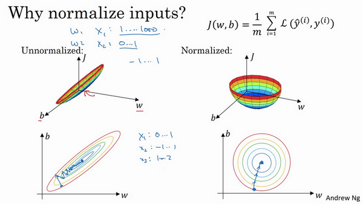

# 归一化输入(Normalizing inputs)  
训练神经网络，其中一个加速训练的方法就是归一化输入。  
假设一个训练集有两个特征，输入特征为2维，归一化需要两个步骤：  
第一步是零均值化，$$\mu = \frac{1}{m}\displaystyle\sum_{i =1}^{m}x^{(i)}$$，它是一个向量，$$x$$等于每个训练数据 $$x$$减去$$\mu$$，意思是移动训练集，直到它完成零均值化。  
第二步是归一化方差，注意特征$$x_{1}$$的方差比特征$$x_{2}$$的方差要大得多，我们要做的是给$$\sigma$$赋值，$$\sigma^{2}= \frac{1}{m}\displaystyle\sum_{i =1}^{m}{(x^{(i)})^2}$$，这是节点$$y$$ 的平方，$$\sigma^{2}$$是一个向量，它的每个特征都有方差，注意，我们已经完成零值均化，$$(x^{(i)})^{2}$$元素$$y^{2}$$就是方差，我们把所有数据除以向量$$\sigma^{2}$$，最后变成下图形式。  
  

**归一化输入特征的意义：**  
归一化特征，使代价函数平均起来看更对称。
假如输入特征$$x$$为2维，$$x_1$$取值范围从1到1000，$$x_2$$取值范围从0到1，未归一化输入的话，结果是参数$$w_{1}$$和$$w_{2}$$值的范围或比率将会非常不同，这些数据轴应该是$$w_{1}$$和$$w_{2}$$，但直观理解，这里标记为$$w$$和$$b$$，代价函数就有点像狭长的碗一样，如下图左侧图形，在这样的代价函数上运行梯度下降法，你必须使用一个非常小的学习率，梯度下降法可能需要多次迭代过程，直到最后找到最小值。进行归一化输入特征后，代价函数函数像一个更圆的球形轮廓，如下图右侧图形，不论从哪个位置开始，梯度下降法都能够更直接地找到最小值，你可以在梯度下降法中使用较大步长，而不需要像在左图中那样反复执行。  
  

# 批归一化:  
也叫Batch归一化(Batch Normalization)，简称BN。  
在神经网络种，如果我们只对输入的数据进行归一化，却没有在中间层进行归一化处理，随着深度网络的多层运算之后，数据分布的变化将越来越大，因此我们应该对每一个隐藏层的输入$$a^{[l-1]}$$也可以进行归一化操作，严格来说,真正归一化的不是$$a{[l-1]}$$,而是$$z^{[l-1]}$$ 。具体做法如下:  
我们将每一层神经网络计算得到的$$Z$$值(在计算激活函数之前的值)进行归一化处理,即将$$Z^{[l]]}$$的值进行归一化处理,进而影响下一层$$W^{[l+1]}$$和$$b^{[l+1]}$$的计算.

1.求每一个训练批次数据的均值 $$\mu = \frac{1}{m}\displaystyle\sum_{i =1}^{m}z^{(i)}$$  
其中，m是当前mini-batch的大小。  
2.求每一个训练批次数据的方差 $$\sigma^{2}= \frac{1}{m}\displaystyle\sum_{i = 1}^{m}{(z^{(i)})^2}$$  
3.归一化,化为含平均值0和标准单位方差 
$$z_{norm}^{(i)} = \frac {z^{(i)} - \mu} {\sqrt { {\sigma}^2 + \varepsilon} }$$  
4.尺度变换和偏移：$${\tilde{z}}^{(i)}= \gamma z_{norm}^{(i)} +\beta$$  
这里的$$\gamma$$是尺度因子，$$\beta$$是平移因子。这一步是BN的精髓，由于归一化后的𝑥𝑖基本会被限制在正态分布下，使得网络的表达能力下降。为解决该问题，我们引入两个新的参数：$$\gamma , \beta$$。 $$\gamma$$和$$\beta$$是在训练时网络学习得到的。  

**Batch归一化的作用：**  
* 通过归一化所有的输入特征值x,允许网络使用较大的学习速率进行训练,可以加速学习。
* Batch 归一化解决了输入值改变的问题,使得所有的输入值在一定的范围内，使得神经网络的所有隐藏层的输入更稳定,它减弱了前层参数的作用与后层参数的作用之间的联系，它使得网络每层都可以自己学习。
* 如果神经元的数据分布改变，我们也许需要重新训练数据以拟合新的数据分布，batch归一化可以确保,无论其怎样变化,其均值和方差将保持不变，避免重新训练数据。
* Batch 归一化还有一个作用,它有轻微的正则化效果，避免过拟合。  

**预测时均值和方差**  
在预测阶段，比如预测单个样本时，我们所使用的均值和方差，其实也是来源于训练集。比如我们在模型训练时我们就记录下每个batch下的均值和方差，待训练完毕后，我们求整个训练样本的均值和方差期望值。  
可利用指数加权平均来估算$$\mu$$和$$\sigma$$：  
训练t个mini-batch得到$$\mu^{\{1\}[l]} , \ \mu^{\{2\}[l]}, \ ..., \ \mu^{\{t\}[l]}$$  然后利用指数加权平均法估算$$\mu$$的值,同理,以这种方式利用指数加权平均的方法估算$$\sigma^2$$  

 
