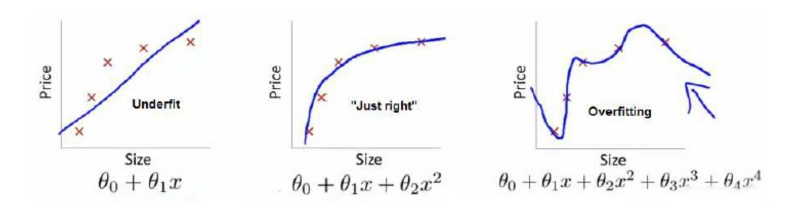
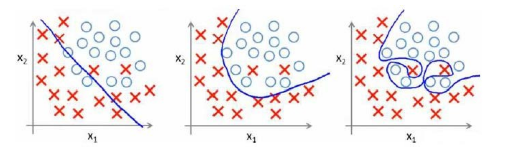
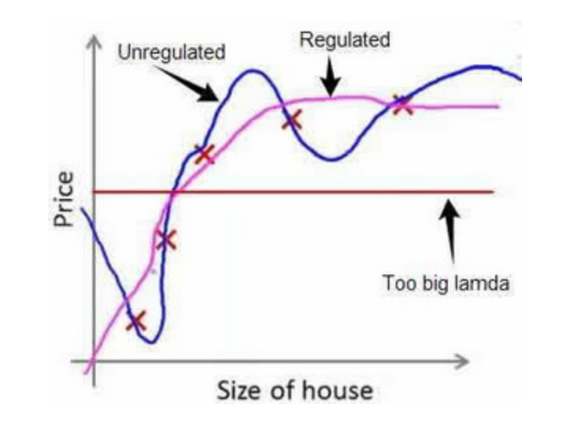

# 正则化 (regularization)

正则化(regularization)的技术，它可以改善或者减少过度拟合问题。  

### 欠逆合与过拟合   
下图是一个回归问题的例子：  
  
第一个模型是一个线性模型，欠拟合，不能很好地适应我们的训练集；  
第三个模型是一个四次方的模型，过于强调拟合原始数据，而丢失了算法的本质：预测新数据。  
我们可以看出，若给出一个新的值使之预测，它将表现的很差，是过拟合，虽然能非常好地适应我们的训练集但在新输入变量进行预测时可能会效果不好；而中间的模型似乎最合适。  
分类问题中也存在这样的问题：  
  

就以多项式理解，x的次数越高，拟合的越好，但相应的预测的能力就可能变差。
问题是，如果我们发现了过拟合问题，应该如何处理？  
1.丢弃一些不能帮助我们正确预测的特征。可以是手工选择保留哪些特征，或者使用一些模型选择的算法来帮忙（例如PCA）。  
2.正则化。 保留所有的特征，但是减少参数的大小（magnitude）。  

### 代价函数  

上面的回归问题中如果我们的模型是： $$ h_\theta(x) = \theta_0 + \theta_1 x_1 + \theta_2 {x_2}^2 + \theta_3 {x_3}^3 + \theta_4 {x_4}^4 $$ 我们可以从之前的事例中看出，正是那些高次项导致了过拟合的产生，所以如果我们能让这些高次项的系数接近于0的话，我们就能很好的拟合了。 所以我们要做的就是在一定程度上减小这些参数$$ \theta $$的值，这就是正则化的基本方法。我们决定要减少$$ \theta_3 $$和$$ \theta_4 $$的大小，我们要做的便是修改代价函数，在其中$$ \theta_3 $$和$$ \theta_4 $$设置一点惩罚。这样做的话，我们在尝试最小化代价时也需要将这个惩罚纳入考虑中，并最终导致选择较小一些的$$ \theta_3 $$和$$ \theta_4 $$。 修改后的代价函数如下：  
$$ min_\theta \ \frac{1}{2m} [ \displaystyle\sum_{i=1}^{m} (h_\theta(x^{(i)}) - y^{(i)})^2 + 1000 {\theta_3}^2 + 1000 {\theta_4}^2 ] $$  
通过这样的代价函数选择出的 $$ \theta_3 $$ 和 $$ \theta_4  $$ 对预测结果的影响就比之前要小许多。假如我们有非常多的特征，我们并不知道其中哪些特征我们要惩罚，我们将对所有的特征进行惩罚，并且让代价函数最优化的软件来选择这些惩罚的程度。这样的结果是得到了一个较为简单的能防止过拟合问题的假设：  
$$ J(\theta) = \frac{1}{2m} [ \displaystyle\sum_{i=1}^{m}(h_\theta(x^{(i)}) - y^{(i)} )^2  + \lambda \displaystyle\sum_{j=1}^{n}(\theta_j)^2  ] $$  
其中 $$ \lambda $$ 又称为 正则化参数（Regularization Parameter）。 注：根据惯例，我们不对 $$ \theta_0 $$ 进行惩罚。经过正则化处理的模型与原模型的可能对比如下图所示：  
  
如果选择的正则化参数 $$ \lambda $$ 过大，则会把所有的参数都最小化了，导致模型变成 $$ h_\theta(x) = \theta_0 $$，也就是上图中红色直线所示的情况，造成欠拟合。 那为什么增加的一项 $$ \lambda \displaystyle\sum_{j=1}^{n}{\theta_j}^2 $$ 可以使 $$ \theta $$ 的值减小呢？ 因为如果我们令 $$ \lambda $$ 的值很大的话，为了使Cost Function 尽可能的小，所有的 $$ \theta $$ 的值（不包括）$$ \theta_0 $$ 都会在一定程度上减小。 但若 $$ \lambda $$ 的值太大了，那么 $$ \theta $$（不包括）$$ \theta_0 $$都会趋近于0，这样我们所得到的只能是一条平行于 $$ x $$ 轴的直线。 所以对于正则化，我们要取一个合理的 的值 $$ \lambda $$，这样才能更好的应用正则化。  

梯度下降：  
$$ {\theta_0} := {\theta_0} - a\frac{1}{m} \displaystyle\sum_{i=1}^{m} ( (h_\theta ({x^{(i)}}) - y^{(i)} ) {x_0}^{(i)} ) $$   
$$ {\theta_j} := {\theta_j} - a [ \frac{1}{m} \displaystyle\sum_{i=1}^{m} ( (h_\theta ({x^{(i)}}) - y^{(i)} ) {x_j}^{(i)} ) + \frac{\lambda}{m} \theta_j ] \ \ \ \ \ \ \ \ (j = 1,2...n) $$  
对上面的算法中 $$ j = 1,2,...,n $$ 时的更新式子进行调整可得：  
$$ {\theta_j} := {\theta_j}(1 - \alpha \frac{\lambda}{m}) - \alpha \frac{1}{m} \displaystyle\sum_{i=1}^{m}(h_\theta(x^{(i)}) - y^{(i)} ) {x_j}^{(i)} $$  
可以看出，正则化线性回归的梯度下降算法的变化在于，每次都在原有算法更新规则的基础上令 $$ \theta $$ 值减少了一个额外的值。  

我们同样也可以利用正规方程来求解正则化线性回归模型，方法如下所示：  

$$ \theta =  { \begin{pmatrix}  X^T X + \lambda
  \begin{bmatrix}
    0& & & &  \\
    &1& & &  \\
    & &1& &  \\
    & & &\ddots & &  \\
    & & & &1 \\
  \end{bmatrix}
\end{pmatrix} }  ^{-1} X^T y $$  

图中的矩阵尺寸为 $$ (n+1) * (n+1) $$ 。

对于逻辑回归，我们也给代价函数增加一个正则化的表达式，得到代价函数：   
$$ J(\theta) = \frac{1}{m} \displaystyle\sum_{i=1}^{m} [ -y^{(i)} \log (h_\theta(x^{(i)})) - (1-y^{(i)}) \log (1-h_\theta(x^{(i)})) ] + \frac{\lambda}{2m} \displaystyle\sum_{j=1}^{n}(\theta_j)^2 $$  
要最小化该代价函数，通过求导，得出梯度下降算法为：  
$$ {\theta_0} := {\theta_0} - a\frac{1}{m} \displaystyle\sum_{i=1}^{m} ((h_\theta(x^{(i)}) - y^{(i)}) {x_0}^{(i)}) $$  
$$ {\theta_j} := {\theta_j} - a [ \frac{1}{m} \displaystyle\sum_{i=1}^{m} (h_\theta(x^{(i)}) - y^{(i)}) {x_j}^{(i)} + \frac{\lambda }{m} \theta_j ] \ \ \ \ \ \ \ \ (j = 1,2...n) $$  
注意：  
1.虽然正则化的逻辑回归中的梯度下降和正则化的线性回归中的表达式看起来一样，但由于两者的 $$ h_\theta(x) $$ 不同所以还是有很大差别。  
2.$$ \theta_0 $$ 不参与其中的任何一个正则化。
