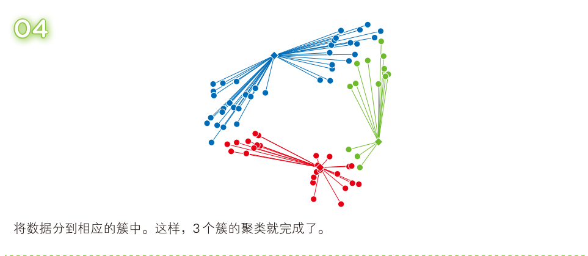

# K-means聚类 (k均值聚类)   

k-means 算法是聚类算法中的一种,它可以根据事先给定的簇的数量k进行聚类。  
以k=3为例，其思想过程如下:  

  

  

  

  

  

  

  

尽管k均值聚类方法很有用，简单朴素，但是它本身存在一定的局限性：  
* 每个数据点只能属于一个群组。然而,数据点可能恰好位于两个群组中间,无法通过k均值聚类方法确定它应该属于哪个群组。  
* 群组被假定是正圆形的。查找距离某个群组中心点最近的数据点,这一迭代过程类似于缩小群组的半径,因此最终得到的群组在形状上类似于正圆形。假设群组的实际形状是椭圆形,那么在应用k均值聚类方法之后,位于椭圆两端的数据点可能会被划入邻近的群组,这会造成很大的问题。  
* 群组被假定是离散的。k均值聚类既不允许群组重叠,也不允许它们相互嵌套。  