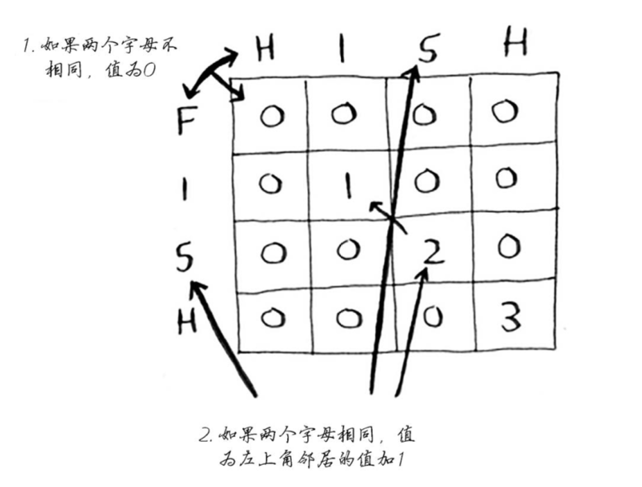
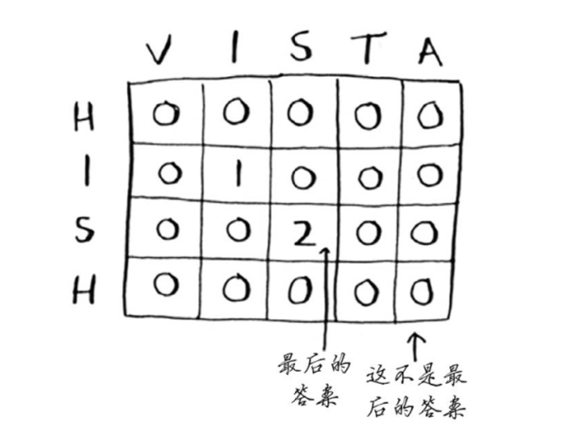
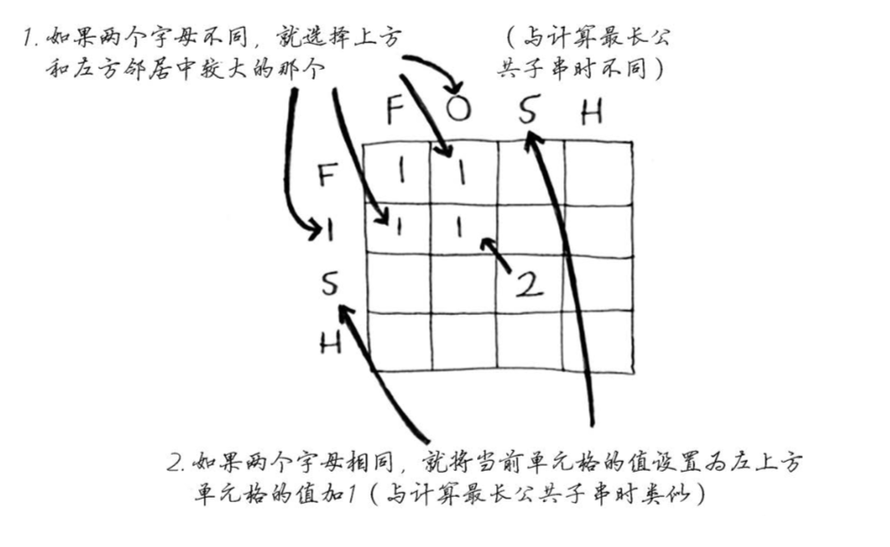
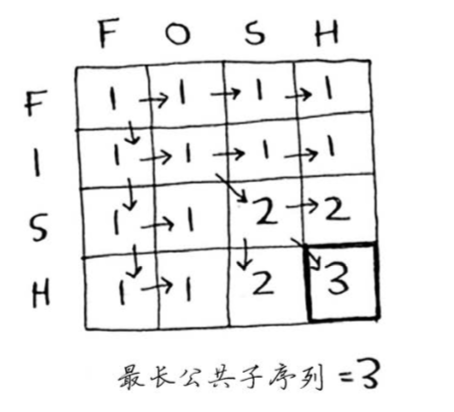

# 最长公共子串/最长公共子序列

**最长公共子串(Longest Common Substring)** 是寻找两个或多个已知字符串最长的子串。  
例如："hish"和"fish"的最长公共子串是"ish"。

**最长公共子序列(Longest Common Subsequence)** 是一个在一个序列集合中（通常为两个序列）用来查找所有序列中最长子序列的问题。一个数列 ，如果分别是两个或多个已知数列的子序列，且是所有符合此条件序列中最长的，则称为已知序列的最长公共子序列。  
例如："hish"和"hosh"的最长公共子序列是"hsh"


**两者区别在于：子串却必须连续，而子序列不必连续。**

### 动态规划求解最长公共子串

* 计算hish和fish的最长公共子串：  
>  

* 计算hish和vista的最长公共子串：  
>  

* 伪代码参考  

```python
if word_a[i] == word_b[j]:
  cell[i][j] = cell[i-1][j-1] + 1
else:
  cell[i][j] = 0
```


### 动态规划求解最长公共子序列  
* 计算hish和fosh的最长公共子串：  
>  

* 伪代码参考  

```python
if word_a[i] == word_b[j]:
  cell[i][j] = cell[i-1][j-1] + 1
else:
  cell[i][j] = max(cell[i-1][j], cell[i][j-1])
```


参考[《算法图解》](http://www.ituring.com.cn/book/1864)
